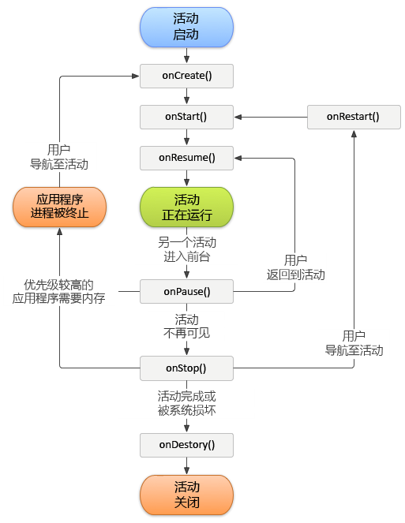

# 跟踪应用程序的崩溃情况 {#track-app-crashes}

此信息可帮助您了解如何跟踪崩溃，以及处理假崩溃的最佳做法。

>[!TIP]
>
>应用程序崩溃作为生命周期指标的一部分进行跟踪。 Before you can track crashes, add the library to your project and implement lifecycle. For more information, see Add the SDK and Config File to your IntelliJ IDEA or Eclipse Project in Core implementation and lifecycle.**[](/help/android/getting-started/dev-qs.md)

实施生命周期量度时，将在每个活动的 `Config.collectLifecycleData` 方法中对 `OnResume` 进行调用。In the `onPause` method, a call is made to `Config.pauseCollectingLifeCycleData`.

在 `pauseCollectingLifeCycleData` 中，设置了一个标志来指示正常退出。再次启动或恢复应用程序后，`collectLifecycleData` 会检查此标志。如果应用程序没有按照标志状态的指示成功退出，将在下次调用时发送 `a.CrashEvent` 上下文数据，并报告崩溃事件。

为了确保准确报告崩溃，您必须在每个活动的 `pauseCollectingLifeCycleData` 方法中调用 `onPause`。要了解为何必须这样做，请参阅下面的 Android 活动生命周期插图：



有关 Android 活动生命周期的更多信息，请参阅[活动](https://developer.android.com/guide/components/activities.html)。

*此 Android 生命周期插图由[Android 开源项目制作和共享](https://source.android.com/)，并依据[创作共用署名 2.5 许可证](https://creativecommons.org/licenses/by/2.5/)中的条款使用。*

## 导致报告假崩溃的原因是什么？

1. 如果您在使用 IDE（如 Android Studio）进行调试，那么在应用程序处于前台时再次从 IDE 启动应用程序会导致崩溃。

   >[!TIP]
   >
   >您可以通过在从IDE再次启动之前对应用程序进行后台处理来避免此崩溃。

1. If the last foreground Activity of your app is backgrounded and does not call `Config.pauseCollectingLifecycleData();` in `onPause`, and your app is manually closed or killed by the OS, the next launch results in a crash.

## 应如何处理碎片？

碎片具有类似于活动的应用程序生命周期事件。但是，碎片在附加到活动的情况下才可处于活动状态。

>[!IMPORTANT]
>
>您需要依赖包含活动可以运行代码的生命周期事件。 这将由碎片的父视图来处理。

## (Optional) Implement activity lifecycle callbacks

从 API 级别 14 开始，Android 允许对活动进行全局生命周期回调。For more information, see [Application](https://developer.android.com/reference/android/app/Application).

You can use these callbacks to ensure that all of your Activities correctly call `collectLifecycleData()` and `pauseCollectingLifecycleData()`. 您需要只在主活动以及可能在其中启动您的应用程序的任何其他活动中添加此代码：

```js
import com.adobe.mobile.Config; 
  
public class MainActivity extends Activity { 
... 
    @Override 
    protected void onCreate(Bundle savedInstanceState) { 
        super.onCreate(savedInstanceState); 
        setContentView(R.layout.activity_main); 
  
        getApplication().registerActivityLifecycleCallbacks(new Application.ActivityLifecycleCallbacks() { 
            @Override 
            public void onActivityResumed(Activity activity) { 
                Config.setContext(activity.getApplicationContext()); 
                Config.collectLifecycleData(activity); 
            } 
  
            @Override 
            public void onActivityPaused(Activity activity) {     
                Config.pauseCollectingLifecycleData(); 
            } 
    
            // the following methods aren't needed for our lifecycle purposes, but are required to be implemented 
            // by the ActivityLifecycleCallbacks object 
            @Override 
            public void onActivityCreated(Activity activity, Bundle savedInstanceState) {} 
            @Override 
            public void onActivityStarted(Activity activity) {} 
            @Override 
            public void onActivityStopped(Activity activity) {} 
            @Override 
            public void onActivitySaveInstanceState(Activity activity, Bundle outState) {} 
            @Override 
            public void onActivityDestroyed(Activity activity) {} 
        }); 
    } 
... 
}
```

To send additional context data with your lifecycle call by using `Config.collectLifecycleData(Activity activity`, `Map<String`, `Object> contextData)`, you must override the `onResume` method for that Activity and ensure that you call `super.onResume()` after manually calling `collectLifecycleData`.

```js
@Override 
protected void onResume() { 
    HashMap<String, Object> cdata = new HashMap<>(); 
    cdata.put("someKey", "someValue"); 
    Config.collectLifecycleData(this, cdata); 
  
    super.onResume(); 
}
```

