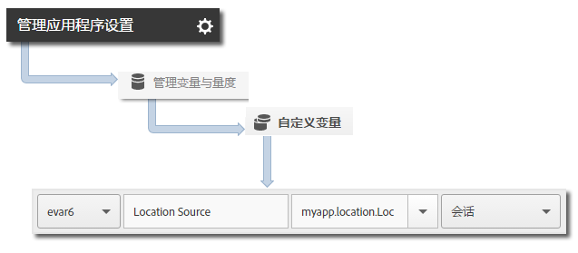

# Geo-location and points of interest {#geo-location-and-points-of-interest}

地理位置可通过在 Android 应用程序中使用纬度和经度以及预定义的目标点，来帮助您测量位置数据。

每个 `trackLocation` 调用均发送以下信息：

* 纬度、经度以及在 Adobe Mobile Services 用户界面中定义的目标点 (POI) 中的位置。

   此信息将传递到移动设备解决方案变量，以便自动进行报告。

* 作为上下文数据传递的到中心的距离以及精确度。

   系统不会自动捕获这些变量。You must map these context data variables by using the instructions in the *Sending Additional Data* section below.

## 动态 POI 更新 {#section_3747B310DD5147E2AAE915E762997712}

从版本 4.2 开始，POI 可在 Adobe Mobile 用户界面中定义并动态同步到应用程序配置文件。This synchronization requires an  setting in the ADBMobile JSON Config:`analytics.poi`[](/help/android/configuration/json-config/json-config.md)

```js
“analytics.poi”: “https://assets.adobedtm.com/…/yourfile.json”,
```

如果未配置此设置，您必须下载更新版本的 `ADBMobile.json` 文件并将其添加到您的应用程序中。For more information, see Download the SDK and Testing Tools.[](/help/android/getting-started/requirements.md)

## Tracking geo-location and POIs {#section_B1616E400A7548F9A672F97FEC75AE27}

1. 将库添加到您的项目并实施生命周期。

   For more information, see Add the SDK and Config File to your IntelliJ IDEA or Eclipse Project in Core implementation and lifecycle.**[](/help/android/getting-started/dev-qs.md)

1. 导入库：

   ```java
   import com.adobe.mobile.*;
   ```

1. 调用 `trackLocation` 以跟踪当前位置：

   ```java
   Location currentLocation = new Location("my location here"); 
   Analytics.trackLocation(currentLocation, null);
   ```

   >[!TIP]
   >
   >You can call  at any time.`trackLocation`

   You can use location strategies to determine the location that is passed to the `trackLocation` call. 有关详细信息，请参 [阅Android位置策略](https://developer.android.com/guide/topics/location/strategies.html)。

此外，如果确定位置位于定义的 POI 半径内，则 `a.loc.poi` 上下文数据变量将随 `trackLocation` 点击一起发送，并在&#x200B;**位置划分**&#x200B;报表中报告为 POI。另外，还将发送 `a.loc.dist` 上下文变量，其中包含到定义坐标的距离（以米为单位）。

## Sending additional data {#section_3EBE813E54A24F6FB669B2478B5661F9}

除了位置数据之外，您还可以通过每个跟踪位置调用发送其他上下文数据：

```java
HashMap<String, Object> locationContextData = new HashMap<String, Object>(); 
locationContextData.put("myapp.location.LocationSource", "GPS"); 
 
Location currentLocation = new Location("my location here"); 
Analytics.trackLocation(currentLocation, locationContextData);
```

上下文数据值必须映射到 Adobe Mobile Services 用户界面中的自定义变量：



## Location context data {#section_FFB71E6653F9410A89CC6ACC0C9164A9}

纬度和经度均使用三个不同的上下文数据参数进行发送，其中每个参数表示不同的精度级别，总共有六个上下文数据参数。

例如，坐标纬度为 40.93231、经度为 -111.93152 表示精度达 1 米的位置。此位置将根据精度级别在以下变量中进行拆分：

`a.loc.lat.a`= 040.9

`a.loc.lat.b` = 32

`a.loc.lat.c` = 31

`a.loc.lon.a` = -111.9

`a.loc.lon.b` = 31

`a.loc.lon.c` = 52

根据当前位置的精确度，某些精度级别可能会显示为 `00`。例如，如果位置当前精确到 100 米，`a.loc.lat.c` 和 `a.loc.lon.c` 将会填充 `00`。

请牢记以下信息：

* A `trackLocation` request sends in the equivalent of a `trackAction` call.

* POI 不会作为典型 `trackAction` 和 `trackState` 调用的一部分进行传递，因此您必须使用 `trackLocation` 调用来跟踪 POI。

* 应当根据需要经常调用 `trackLocation` 以跟踪位置和 POI。

   我们建议在应用程序启动时调用 `trackLocation`，之后可根据应用程序的要求在需要时进行调用。

* 只有在应用程序配置文件中定义 POI 后，才会填充 POI。

   POI 不适用于先前发送的历史 `trackLocation` 调用。
* `trackLocation` 调用支持发送其他上下文数据，这一点与 `trackAction` 调用类似。

* 如果有两个 POI 的直径重叠，则使用包含当前位置的第一个 POI。

   如果您的 POI 重叠，您应当按照从最大粒度到最小粒度的顺序列出 POI，以确保报告最大粒度的 POI。

