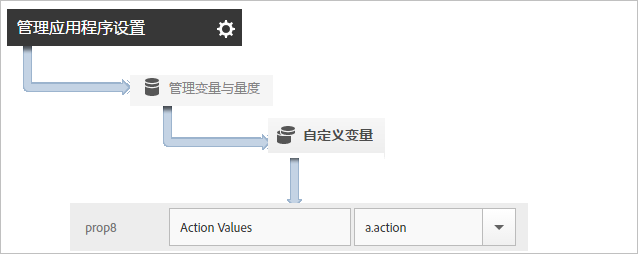

# 跟踪应用程序操作 {#track-app-actions}

操作是指在您要测量的应用程序中发生的事件。每个操作均具有一个或多个对应的量度，每当发生事件时，这些量度的数量都会递增。例如，对于每个新订阅，每当查看文章时，或每当完成某个级别时，您都可以发送一个跟踪调用。这些事件的相应量度可配置为订阅、已读文章和完成程度。

系统不会自动跟踪操作，因此要跟踪事件，您必须调用 `trackAction`。

## 跟踪操作 {#section_380DF56C4EE4432A823940E4AE4C9E91}

1. 将库添加到您的项目并实施生命周期。

   有关更多信息，请参阅[核心实施和生命周期](/help/ios/getting-started/dev-qs.md)中的“将 SDK 和配置文件添加到您的项目”**。
1. 导入库。

   ```objective-c
   #import "ADBMobile.h"
   ```

1. 当您的应用程序中发生要跟踪的操作时，请调用 `trackAction` 以发送此操作的点击。

   ```objective-c
   [ADBMobile trackAction:@"myapp.ActionName"  
                     data:nil];
   ```

   >[!TIP]
   >
   >如果您要在其中添加此调用的代码可能会在应用程序处于后台时运行，请调用 `trackActionFromBackground` 而不是 `trackAction`。

1. 在 Adobe Mobile Services 用户界面中，选择您的应用程序，然后单击&#x200B;**[!UICONTROL 管理应用程序设置]**。

1. 单击&#x200B;**[!UICONTROL 管理变量和量度]**，然后再单击&#x200B;**[!UICONTROL 自定义量度]**&#x200B;选项卡。

1. 将代码中定义的上下文数据名称（例如 `a.action=myapp.ActionName`）映射到某个自定义事件。

   

您还可以通过以下方法将某个 prop 设置为保存所有操作值：映射自定义 prop（具有&#x200B;**[!UICONTROL 自定义操作]**&#x200B;之类的名称），并将值设置为 `a.action`。



## 发送其他数据 {#section_3EBE813E54A24F6FB669B2478B5661F9}

除了操作名称之外，您还可以通过每个跟踪操作调用发送其他上下文数据：

```objective-c
NSMutableDictionary *contextData = [NSMutableDictionary dictionary]; 
[contextData setObject:@"Twitter" forKey:@"myapp.social.SocialSource"]; 
[ADBMobile trackAction:@"myapp.SocialShare" data:contextData];
```

上下文数据值必须映射到以下自定义变量：


## 跟踪后台操作 {#section_AC13013F207D4FBAAF27E4412034251E}

如果用于跟踪操作的代码可能会在应用程序处于后台时运行，请调用 `trackActionFromBackground`，而不是 `trackAction`。尽管 `trackActionFromBackground` 包含其他一些逻辑，可阻止生命周期调用在不应触发时被触发，但参数是相同的。

## 操作报告 {#section_0F6A54AB7A3F42C9BB042D86A0FC4630}

| 界面 | 报表 |
|--- |--- |
| Adobe Mobile Services | **[!UICONTROL 操作路径]**&#x200B;报表。查看操作在应用程序中发生的顺序。您还可以单击任何报表中的&#x200B;**[!UICONTROL 自定义]**，以查看操作排名、趋势或在划分报表中查看操作，也可以应用过滤器以查看特定区段的操作。 |
| Marketing Reports and Analytics | **[!UICONTROL 自定义事件]**&#x200B;报表。在将操作映射到自定义事件后，您可以查看与所有其他 Analytics 事件类似的移动设备事件。 |
| Ad Hoc Analytics | **[!UICONTROL 自定义事件]**&#x200B;报表。在将操作映射到自定义事件后，您可以查看与所有其他 Analytics 事件类似的移动设备事件。 |