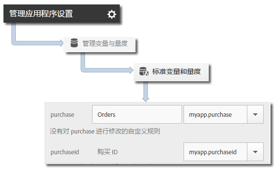

# Products 变量 {#products-variable}

无法使用处理规则来设置产品变量。在 iOS 4.x SDK 中，必须在上下文数据参数中使用特殊语法来直接设置服务器调用中的产品。

要设置 *`products`* 变量，请将上下文数据键设置为 `"&&products"`，然后使用为 *`products`* 变量定义的语法来设置值：

```objective-c
[contextData setObject:@"Category;Product;Quantity;Price[,Category;Product;Quantity;Price]" forKey:@"&&products"];
```

例如：

```objective-c
//create a context data dictionary 
NSMutableDictionary *contextData = [NSMutableDictionary dictionary]; 
 
// add products, a purchase id, a purchase context data key, and any other data you want to collect. 
// Note the special syntax for products 
[contextData setObject:@";Running Shoes;1;69.95,;Running Socks;10;29.99" forKey:@"&&products"]; 
[contextData setObject:@"1234567890" forKey:@"m.purchaseid"]; 
[contextData setObject:@"1" forKey:@"m.purchase"]; 
 
// send the tracking call - use either a trackAction or TrackState call. 
// trackAction example: 
[ADBMobile trackAction:@"purchase" data:contextData]; 
// trackState example: 
[ADBMobile trackState:@"Order Confirmation" data:contextData]; 
```

*`products`* 直接在图像请求中设置，而其他变量则设置为上下文数据：必须使用处理规则来映射所有上下文数据变量：



您无需使用处理规则来映射 *`products`* 变量，因为 SDK 会直接在图像请求中设置此变量。
