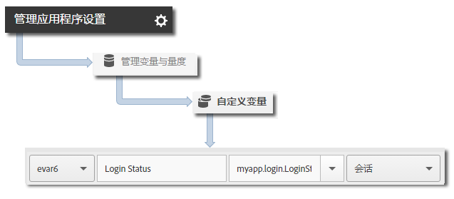

# 跟踪应用程序状态 {#track-app-states}

状态是指您的应用程序中的不同屏幕或视图。每当应用程序中显示了新状态（例如，用户从主页导航到新闻源）时，应会发送一个跟踪状态调用。在 iOS 中，通常会在每种视图的 viewDidLoad 方法中跟踪状态。

>[!TIP]
>
>要跟踪状态，请调用 `trackState`。不会自动跟踪状态。

## 跟踪状态 {#section_380DF56C4EE4432A823940E4AE4C9E91}

1. 将库添加到您的项目并实施生命周期。

   有关更多信息，请参阅[核心实施和生命周期](/help/ios/getting-started/dev-qs.md)中的“将 SDK 和配置文件添加到您的项目”**。
1. 导入库。

   ```objective-c
   #import "ADBMobile.h"
   ```

1. 调用 `trackState` 以便为此状态视图发送点击。

   ```objective-c
   [ADBMobile trackState:@"Login Screen"  
                    data:nil];
   ```

在 Adobe Mobile Services 中，**[!UICONTROL 状态名称]**&#x200B;将在 *`View State`* 变量中进行报告，并且每个 `trackState` 调用均会记录一个视图。在其他 Analytics 界面中，**[!UICONTROL 视图状态]**&#x200B;将被报告为&#x200B;**[!UICONTROL 页面名称]**，“状态查看次数”将被报告为“页面查看次数”。

## 发送其他数据 {#section_CFDB4F944496401786A145C209AB387C}

除了&#x200B;**[!UICONTROL 状态名称]**&#x200B;之外，您还可以通过每个跟踪操作调用发送其他上下文数据：

```objective-c
NSMutableDictionary *contextData = [NSMutableDictionary dictionary]; 
[contextData setObject:@"logged in" forKey:@"myapp.login.LoginStatus"]; 
[ADBMobile trackState:@"Home Screen" data:contextData];
```

上下文数据值必须映射到以下自定义变量：



## 应用程序状态报告 {#section_0F6A54AB7A3F42C9BB042D86A0FC4630}

状态通常使用路径报表来查看，以便您能够了解用户在应用程序中的导航方式以及最常查看的状态。

|  |  |
|--- |--- |
| Adobe Mobile Services | **[!UICONTROL 视图状态]**&#x200B;报表。此报表基于用户在您的应用程序中浏览的路径。示例路径为&#x200B;**[!UICONTROL 主页]** > **[!UICONTROL 设置]** > **[!UICONTROL 信息源]**。 |
| Adobe Analytics | 可以从任何能够查看页面的位置查看状态，如&#x200B;**[!UICONTROL 页面]**&#x200B;报表、**[!UICONTROL 页面查看次数]**&#x200B;报表和&#x200B;**[!UICONTROL 路径]**&#x200B;报表。 |
| Ad Hoc Analytics | 可以使用&#x200B;**[!UICONTROL 页面]**&#x200B;维度、**[!UICONTROL 页面查看次数]**&#x200B;量度和&#x200B;**[!UICONTROL 路径]**&#x200B;报表从任何能够查看页面的位置查看状态。 |
