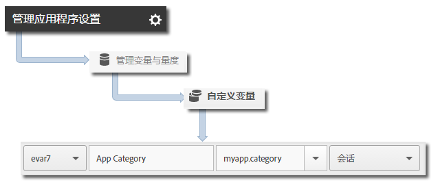

# Core implementation and lifecycle {#core-implementation-and-lifecycle}

此信息可帮助您实施 iOS 库并收集生命周期量度，例如启动次数、升级次数、会话数、参与用户数等。

## 下载 SDK {#section_99FE1A17A36D4A2C943939023CF6265C}

>[!IMPORTANT]
>
>To download the SDKs, you **must** use iOS 6 or later.

**先决条件**

在下载SDK之前，请完成在 *Core实施和生命周期中创建报告套件*[](/help/ios/getting-started/requirements.md) ，以设置开发报告套件并下载预填充版本的配置文件中的步骤。

要下载 SDK，请执行以下操作：

1. Download, unzip the `[Your_App_Name_]AdobeMobileLibrary-4.*-iOS.zip` file and verify that you have the following software components:

   * `ADBMobile.h`，用于 iOS AppMeasurement 的 Objective-C 头文件。
   * `ADBMobileConfig.json`，为您的应用程序自定义的 SDK 配置文件。
   * `AdobeMobileLibrary.a`、支持位代码的胖二进制文件，它包含用于iOS设备(armv7、armv7s、arm64)和模拟器(i386、x86_64)的库构建。

      当目标面向 iOS 应用程序时，应该关联此胖二进制文件。

   * `AdobeMobileLibrary_Extension.a`，启用 bitcode 的胖二进制文件，其中包含为 iOS 设备（armv7、armv7s、arm64）和模拟器（i386、x86_64）生成的库。

      当目标面向 iOS 扩展时，应该关联此胖二进制文件。

   * `AdobeMobileLibrary_Watch.a`，启用 bitcode 的胖二进制文件，其中包含为 Apple Watch 设备 (armv7k) 和模拟器（i386、x86_64）生成的库。

      当目标面向 Apple Watch (watchOS 2) 扩展应用程序时，应该关联此胖二进制文件。

   * `AdobeMobileLibrary_TV.a`，启用 bitcode 的胖二进制文件，其中包含为新 Apple TV 设备 (arm64) 和模拟器 (x86_64) 生成的库。

      当目标面向 Apple TV (tvOS) 应用程序时，应该关联此胖二进制文件。

>[!IMPORTANT]
>
>If you download the SDK outside the Adobe Mobile services UI, the `ADBMobileConfig.json` file must be manually configured. If you are new to Analytics and the Mobile SDK, see [Before You Start](/help/ios/getting-started/requirements.md) to set up a development report suite and download a pre-populated version of the configuration file.

## Add the SDK and config file to your project {#section_93C25D893B4A4CD3B996CF3C5590C8DC}

1. 启动 Xcode IDE 并打开您的应用程序。
1. 在项目导航器中，将 `AdobeMobileLibrary` 文件夹拖放到您的项目下。
1. 确认以下内容：

   * 已选中&#x200B;**[!UICONTROL 根据需要复制项目]复选框。**
   * **[!UICONTROL 已选中创建组]**。
   * 未选中&#x200B;**[!UICONTROL 添加到目标]部分中的任何复选框。**
   

1. Click **[!UICONTROL Finish]**.
1. In **[!UICONTROL Project Navigator]**, select **[!UICONTROL`ADBMobileConfig.json`]**.
1. In **[!UICONTROL File Inspector]**, add the JSON file to any targets in your project that will use the Adobe SDK.

   

1. In **[!UICONTROL Project Navigator]**, complete the following steps:

   1. 单击您的应用程序。
   1. 在&#x200B;**[!UICONTROL 常规]**&#x200B;选项卡上，选择您的目标并关联&#x200B;**[!UICONTROL 关联的框架]和**&#x200B;库]部分中的所需框架和库。**[!UICONTROL **
   * **iOS 应用程序目标**
      * `SystemConfiguration.framework`
      * `WebKit.framework`
      * `libsqlite3.0.tbd`
      * `AdobeMobileLibrary.a`
   * **iOS 扩展目标**

      * `SystemConfiguration.framework`
      * `libsqlite3.0.tbd`
      * `AdobeMobileLibrary\_Extension.a`
   * **Apple Watch (watchOS 2) 目标**

      * `libsqlite3.0.tbd`
      * `AdobeMobileLibrary\_Watch.a`
   * **Apple TV (tvOS) 目标**

      * `SystemConfiguration.framework`
      * `libsqlite3.0.tbd`
      * `AdobeMobileLibrary\_TV.a`
   >[!CAUTION]
   >
   > Linking more than one `AdobeMobileLibrary*.a` file in the same target will result in unexpected behavior or the inability to build.

1. 确认您的应用程序在生成时没有出现错误。

## Implement lifecycle metrics {#section_532702562A7A43809407C9A2CBA80E1E}

>[!IMPORTANT]
>
>iOS will send lifecycle information with or without calling `collectlifecycledata`, and `collectlifecycledata` is only a way to initiate lifecycle earlier in the application's launch sequence.

After you enable lifecycle, each time your app is launched, one hit is sent to measure launches, upgrades, sessions, engaged users, and other [Lifecycle Metrics](/help/ios/metrics.md).

添加 `collectLifecycleData`/ `collectLifecycleDataWithAdditionalData` 呼叫 `application:didFinishLaunchingWithOptions`:

```objective-c
- (BOOL)application:(UIApplication *)application didFinishLaunchingWithOptions:(NSDictionary *)launchOptions { 
 [ADBMobile collectLifecycleData]; 
    return YES; 
}
```

### 在生命周期调用中包含其他数据

要通过生命周期量度调用包含其他数据，请使用 `collectLifecycleDataWithAdditionalData`：

>[!IMPORTANT]
>
>Any data that is passed to the SDK through `collectLifecycleDataWithAdditionalData:` is persisted in `NSUserDefaults` by the SDK. SDK 会删除 `NSDictionary` 参数中类型不为 `NSString` 或 `NSNumber` 的值。

```objective-c
- (BOOL)application:(UIApplication *)application didFinishLaunchingWithOptions:(NSDictionary *)launchOptions { 
    NSMutableDictionary *contextData = [NSMutableDictionary dictionary]; 
    [contextData setObject:@"Game" forKey:@"myapp.category"]; 
    [ADBMobile collectLifecycleDataWithAdditionalData:contextData]; 
    return YES; 
}
```

通过 `collectLifecycleDataWithAdditionalData` 发送的其他上下文数据值必须映射到 Adobe Mobile Services 中的自定义变量：



其他生命周期量度将会自动收集。有关更多信息，请参阅[生命周期量度](/help/ios/metrics.md)。

## 后续操作 {#section_A24DC703359D4B5C8F493D6421306FD3}

完成以下任务：

* [跟踪应用程序状态](/help/ios/analytics-main/states.md)
* [跟踪应用程序操作](/help/ios/analytics-main/actions.md)
