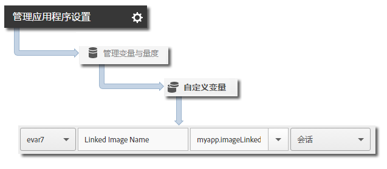

# iBeacon 跟踪 {#ibeacon-tracking}

通过 iBeacon 跟踪，您可以使用 iBeacon 和低功耗蓝牙测量并定位微位置。

在调用 `trackBeacon` 时，会将以下信标数据发送到 Analytics 和 Target：

* `a.beacon.uuid` - 信标的 ProximityUUID
* `a.beacon.major` - 信标的主编号，如存储编号
* `a.beacon.minor` - 信标的次编号，如存储内的唯一编号
* `a.beacon.prox` - 以下值表示用户与信标的接近度：

   * `0` 表示未知
   * `1` 表示紧挨
   * `2` 表示近
   * `3` 表示远

## 跟踪 iBeacon {#section_FC3F213545944A468B1E6D5D5C8E2F1F}

1. 将库添加到您的项目并实施生命周期。

   有关更多信息，请参阅[核心实施和生命周期](/help/ios/getting-started/dev-qs.md)中的“将 SDK 和配置文件添加到您的项目”**。
1. 导入库：

   ```objective-c
   #import "ADBMobile.h"
   ```

1. 当设备接近信标时，调用 `trackBeacon`：

   ```objective-c
   [ADBMobile trackBeacon:beacon data:nil];
   ```

1. 当用户远离信标时，清除当前信标：

   ```objective-c
   [ADBMobile trackingClearCurrentBeacon];
   ```

## 发送其他数据 {#section_3EBE813E54A24F6FB669B2478B5661F9}

除了定时操作名称之外，您还可以通过每个跟踪操作调用发送其他上下文数据：

```objective-c
[ADBMobile trackBeacon:beacon data:@{@"myapp.ImageLiked" : imageName}];
```

上下文数据值必须映射到以下自定义变量：



## 示例 {#section_9749238BCBC148998CB18E97D7670D19}

```objective-c
- (void)locationManager:(CLLocationManager *)manager didRangeBeacons:(NSArray *)beacons inRegion:(CLBeaconRegion *)region { 
    if (beacons.count > 0) { 
        CLBeacon *beacon = beacons[0]; 
        // Adobe - track when in range of a beacon 
        [ADBMobile trackBeacon:beacon data:@{@"sampleContextData" : @"sampleContextDataVal"}]; 
    } 
} 
 
// When the user leaves the proximity of the beacon, clear the current beacon 
[ADBMobile trackingClearCurrentBeacon];
```
