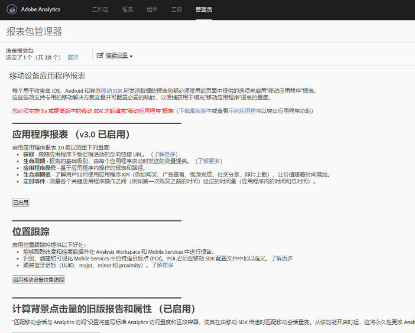

# Analytics {#analytics}

在将库添加到项目后，您可以在应用程序中的任意位置进行任何Analytics方法调用。

>[!TIP]
>
>确保导入 `ADBMobile.h` 到您的类。

## 在Analytics中启用移动应用程序报告 {#section_F2F9234009184F20BA36B5CDE872B424}

在添加代码之前，请让Analytics管理员完成以下操作以启用移动应用程序生命周期跟踪。 这可确保您的报表包在您开始开发时能够捕获指标。

1. 打 **[!UICONTROL 开“管理]** 工具” **[!UICONTROL >“报表包]** ”，然后选择移动报表包。

1. 单击 **[!UICONTROL “编辑设置]** ”>“ **[!UICONTROL 移动管理]** ”>“移 **[!UICONTROL 动应用程序报告]**”。

   

1. 单击“ **[!UICONTROL 启用最新的应用程序报告]**”。

   或者，您也可以单击“启 **[!UICONTROL 用移动位置跟踪]** ” **[!UICONTROL 或“启用旧版报告和归因”获取后台点击]**。

   

生命周期指标现在可以捕获，移动应用程序报表显示在营销 **[!UICONTROL 报表界]** 面的“报表”菜单中。

### 新版本

定期发布新版本的移动应用程序报告。 新版本不会自动应用到报表包，您必须重复这些步骤才能执行升级。 每次您向应用程序添加新的Experience Cloud功能时，我们建议您重复这些步骤，以确保您具有最新配置。

## 生命周期量度 {#section_532702562A7A43809407C9A2CBA80E1E}

要在应用程序中收集生命周期指标，请在激活应用程序时添加调用，如以下示例所示。

### default.js中的WinJS

```js
app.onactivated = function (args) { 
  if (args.detail.kind === activation.ActivationKind.launch) { 
   ... 
   // launched and resumed stuff  
   ADBMobile.Config.collectLifecycleData(); 
  } 
}; 
app.oncheckpoint = function (args) { 
  ADBMobile.Config.pauseCollectingLifecycleData(); 
}
```

### App.xaml.cs中的C&#35;

```js
public App() 
{ 
    this.InitializeComponent(); 
    this.Resuming += OnResuming; 
    this.Suspending += OnSuspending; 
} 
protected override void OnLaunched(LaunchActivatedEventArgs e) 
{   ... 
    ADBMobile.Config.CollectLifecycleData(); 
    ... 
} 
private void OnResuming(object sender, object e) 
{ 
    ... 
    ADBMobile.Config.CollectLifecycleData(); 
    ... 
} 
private void OnSuspending(object sender, SuspendingEventArgs e) 
{ 
    ... 
    ADBMobile.Config.PauseCollectingLifecycleData(); 
    ... 
}
```

### App.xaml.cpp 中的 C++/CX

```js
App::App() 
{ 
 InitializeComponent(); 
 Resuming += ref new EventHandler<Object ^>(this, &App::OnResuming); 
 Suspending += ref new SuspendingEventHandler(this, &App::OnSuspending); 
} 
void App::OnResuming(Object ^sender, Object ^args) 
{ 
 ... 
 ADBMobile::Config::CollectLifecycleData(); 
 ... 
} 
void App::OnSuspending(Object^ sender, SuspendingEventArgs^ e) 
{ 
 ... 
 ADBMobile::Config::PauseCollectingLifecycleData(); 
 ... 
} 
void App::OnLaunched(Windows::ApplicationModel::Activation::LaunchActivatedEventArgs^ e) 
{ 
 ... 
 ADBMobile::Config::CollectLifecycleData(); 
 ... 
}
```

如果 `CollectLifecycleData()` 在同一会话中调用两次，则应用程序在第一次呼叫后的每次呼叫中都报告崩溃。 SDK在应用程序关闭时设置一个标志，指示成功退出。 如果未设置此标志，则 `CollectLifecyleData()` 报告崩溃。

## Event、Prop 和 eVar {#section_76EA6F5611184C5CAE6E62956D84D7B6}

如果您已经研究过 [SDK方法](/help/universal-windows/c-configuration/methods.md)，您可能会想知道在哪里设置事件、eVar、prop、继承人和列表。 在版本4中，您无法再直接在应用程序中分配这些类型的变量。 相反，SDK使用上下文数据和处理规则将应用程序数据映射到Analytics变量以进行报告。

处理规则为您提供了几个优势：

* 您无需向App Store提交更新即可更改数据映射。
* 您可以对数据使用有意义的名称，而不是设置特定于报表包的变量。
* 发送额外数据几乎没有影响。 这些值只有在使用处理规则映射后才会显示在报告中。

您直接分配给变量的任何值都应添加到上下文数据中。

## 处理规则 {#section_66EE762EEA5E4728864166201617DEBF}

处理规则用于将您在上下文数据变量中发送的数据复制到evar、prop和其他变量以进行报告。

[2013年峰会上的处理规则](https://tv.adobe.com/embed/1181/16506/) 培训

[处理规则帮助](https://docs.adobe.com/content/help/zh-Hans/analytics/admin/admin-tools/processing-rules/processing-rules.html)

[获得使用处理规则的授权](https://helpx.adobe.com/analytics/kb/processing-rules-authorization.html)

我们建议使用“命名空间”对上下文数据变量进行分组，因为这有助于您保持逻辑顺序。 例如，如果要收集有关产品的信息，您可以定义以下变量：

```javascript
"product.type":"hat" 
"product.team":"mariners" 
"product.color":"blue"
```

上下文数据变量在处理规则界面中按字母顺序排序，因此命名空间允许您快速查看处于同一命名空间的变量。

此外，我们听说有些人使用evar或prop编号命名上下文数据键：

```js
"eVar1":"jimbo"
```

这可能会使处 *理规则* 中执行一次映射时的操作略为简单，但调试过程中会失去可读性，将来的代码更新可能更困难。 我们强烈建议对键和值使用描述性名称：

```js
"username":"jimbo"
```

将定义计数器事件的上下文变量设置为值“1”:

```js
"logon":"1"
```

定义增量事件的上下文数据变量可以具有要增量的值：

```js
"levels completed":"6"
```

>[!TIP]
>
>Adobe 会保留命名空间 `a.`。除此限制外，上下文数据变量在登录公司中只需是唯一的，即可避免冲突。

## 产品变量 {#section_AFBA36F3718C44D29AF81B9E1056A1B4}

要在移 *`products`* 动SDK中进行设置，必须使用特殊语法。 有关详细信息，请参阅 [产品变量](/help/universal-windows/analytics/products.md)。

## （可选）启用脱机跟踪 {#section_955B2A03EB854742BDFC4A0A3C287009}

要在设备脱机时存储点击，可在SDK方法文件中启 [用脱机跟踪](/help/universal-windows/c-configuration/methods.md) 。 在启用脱机跟踪之前，请仔细注意配置文件引用中描述的时间戳要求。

## 地理位置和目标点 {#section_BAD34A8DD013454DB355121316BD7FD4}

地理位置允许您测量位置数据（经纬度）和预定义的兴趣点。 每次 `TrackLocation` 呼叫均发送：

* 纬度／经度和POI(如果在配置文件中定义的POI `ADBMobileConfig.json` 中)。

   这些变量将传递给移动解决方案变量以实现自动报告。

* 中心距离和作为上下文数据传递的准确性。

   使用处理规则进行捕获。

跟踪位置：

```js
var ADB = ADBMobile; 
ADB.Analytics.trackLocation(37.75345, -122.33207, null);
```

如果在配置文件中定义了以 `ADBMobileConfig.json` 下POI:

```js
"poi" : [ 
            ["San Francisco",37.757144,-122.44812,7000], 
        ]
```

当设备位置被确定为在定义点的7000米半径内时，具有该值的上下文 `a.loc.poi` 数据变量随 `San Francisco` 点击一起发送 `TrackLocation` 。 An `a.loc.dist` context variable is sent with the distance in meters from the defined coordinates.

## Lifetime value {#section_D2C6971545BA4D639FBE07F13EF08895}

您可以使用生命周期值测量和定位每个用户的生命周期值。每当您通过 `TrackLifetimeValueIncrease` 发送值时，该值都会添加到现有值。生命周期值存储在设备上，并可随时通过调用 `GetLifetimeValue` 进行检索。此值可用于存储生命周期购买、广告查看、视频完成、社交分享、照片上载等。

```js
// Lifetime Value Example 
var ADB = ADBMobile; 
var purchasePrice = 39.95; 
var cdata = new Windows.Foundation.Collections.PropertySet(); 
cdata["ItemPurchaseEvent"] = "ItemPurchaseEvent"; 
cdata["PurchaseItem"] = "Item453"; 
cdata["PurchasePrice"] = purchasePrice; 
ADB.Analytics.trackLifetimeValueIncrease(purchasePrice, cdata);
```

## 定时操作 {#section_7FF8B6A913A0460EAA4CAE835E32D8C1}

定时操作允许您衡量操作开始和结束之间的应用程序内时间和总时间。 SDK计算会话中的时间量以及完成操作所花费的总时间（跨会话）。 这可用于定义区段，以按时进行购买、通过级别、结帐流程等比较。

* 应用程序中开始和结束——跨会话的总秒数
* 开始和结束之间的总秒数（时钟时间）

```js
// Timed Action Start Example 
var ADB = ADBMobile; 
var cdata = new Windows.Foundation.Collections.PropertySet(); 
cdata["ExperienceName"] = experience; 
ADB.Analytics.trackTimedActionStart("TimeUntilPurchase", cdata);
```

```js
// Timed Action Update Example 
var ADB = ADBMobile; 
var cdataUpdate = new Windows.Foundation.Collections.PropertySet(); 
cdataUpdate["ImageLiked"] = imageName; 
ADB.Analytics.trackTimedActionStart("TimeUntilPurchase", cdata); 
```

```js
// Timed Action End Example 
var ADB = ADBMobile; 
ADB.Analytics.trackTimedActionEnd("TimeUntilPurchase");
```
