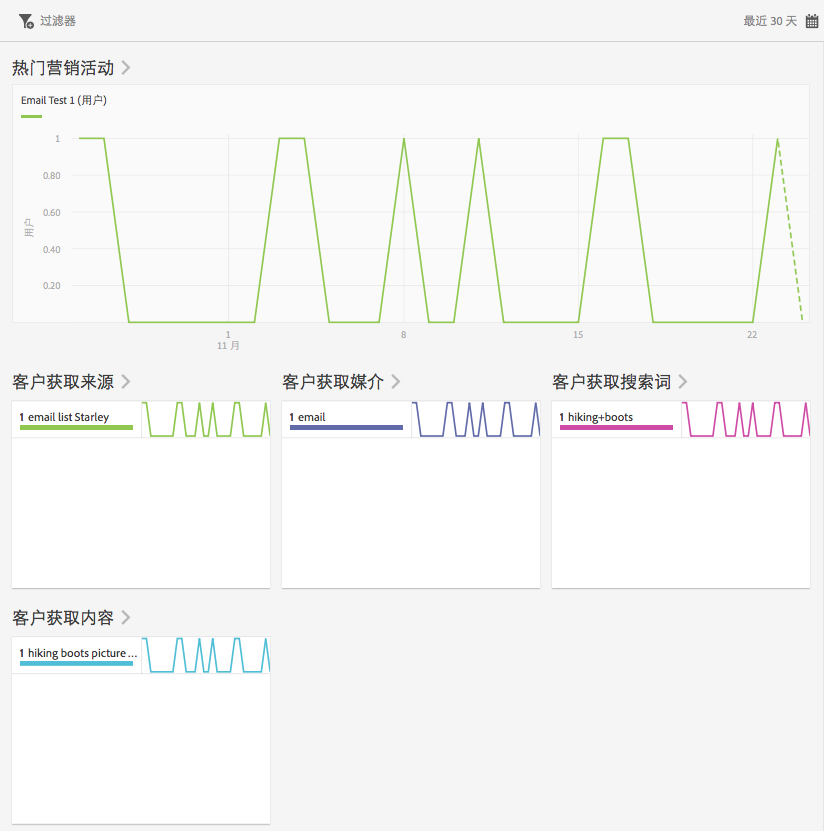
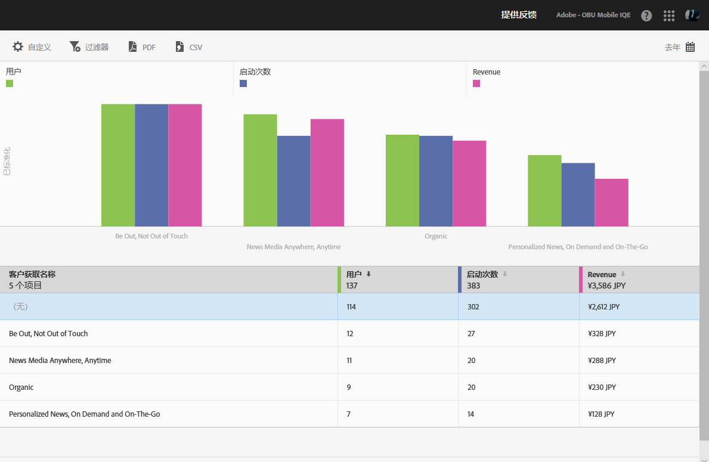

# 客户获取 {#acquisition}

营销人员可创建跟踪链接以将更多流量引入到应用程序。这些跟踪链接可以驱使用户进入应用商店、应用程序深层链接和插播式广告，从而与应用程序内行为相关联。营销人员可以创建一个链接，以将用户路由到适合的 iOS、Android 或其他平台。

## 新的 Adobe Experience Cloud SDK 版本

正在寻找与 Adobe Experience Platform Mobile SDK 相关的信息和文档？请单击[此处](https://aep-sdks.gitbook.io/docs/)获取我们的最新文档。

在 2018 年 9 月，我们发布了一个新的 SDK 主要版本。这些新的 Adobe Experience Platform Mobile SDK 可通过 [Experience Platform Launch](https://www.adobe.com/cn/experience-platform/launch.html) 进行配置。

* 要开始配置，请转到 [Launch](https://launch.adobe.com/)。
* 要查看 Experience Platform SDK 存储库中的内容，请转到 [Github：Adobe Experience Platform SDK](https://github.com/Adobe-Marketing-Cloud/acp-sdks)。

>[!IMPORTANT]
>
> 如果您要在 Adobe Launch 中使用 Adobe Experience Platform Mobile SDK，则还&#x200B;**必须**&#x200B;安装 Adobe Analytics Mobile Services 扩展才能使用 Adobe Mobile Services 功能，例如客户获取链接。有关更多信息，请参阅 [Adobe Analytics - Mobile Services](https://aep-sdks.gitbook.io/docs/using-mobile-extensions/adobe-analytics-mobile-services)。有关在 Experience Cloud SDK 中使用客户获取和营销链接的更多信息，请参阅[客户获取和营销链接](https://aep-sdks.gitbook.io/docs/using-mobile-extensions/adobe-analytics-mobile-services#acquisition-and-marketing-links)。

>[!IMPORTANT]
>
>虽然您可以在 UI 中配置功能，但配置的功能要在下载生成的配置文件并将其添加到 SDK 后才能正常工作。有关下载和配置 SDK 的信息，请参阅此页面上的 *SDK 文档*&#x200B;部分。

您可以创建、编辑、管理和查看有关可跟踪移动设备应用程序营销链接的报表。

>[!TIP]
>
>此功能需要 Adobe Analytics - Mobile Apps 或 Adobe Analytics Premium SKU。

以下“客户获取”报表对如何执行营销链接提供了深入的分析：

* **概述** {#section_5B2BA47F22694919A472AB591101237E}

   此报表显示了将用户引导至您的应用程序的热门营销活动，其中包含有关如何跨越其他跟踪元数据（如客户获取源、媒介、搜索词和内容）执行营销活动的信息。

   

* **链接报表** {#section_A23A640C363B43569D9D484CF49EA277}

   此报表提供了您的营销链接性能的排名视图。除了显示您的链接名称以及关键性能量度外，此报表还是可自定义的。有关更多信息，请参阅[自定义报表](/help/using/usage/reports-customize/t-reports-customize.md)。

   请牢记以下信息：

   * 您可以单击列标题中的箭头图标，以按升序或降序对数据进行排序。
   * 要将数据导出到 PDF 文档，您可以单击&#x200B;**[!UICONTROL 下载]**。
   
