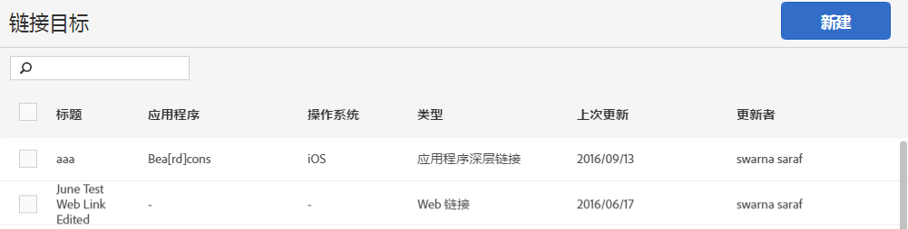

# 创建和管理链接目标{#create-and-manage-link-destinations}

在“管理链接目标”页面中，您可以创建、编辑、存档/取消存档和删除链接目标。在生成营销链接、推送通知或应用程序内消息时，这些目标可以在内联调用。

要显示管理链接目标页面，请执行以下操作：

1. 从左侧导航菜单中，单击&#x200B;**[!UICONTROL 管理应用程序]**。
1. 单击某个应用程序的名称以显示其“应用程序信息”页面。
1. 单击右上角的&#x200B;**[!UICONTROL 管理链接目标]**。

“链接目标”页面显示您的链接目标，并提供用于创建、存档、取消存档、编辑和删除链接目标的选项。

例如：

