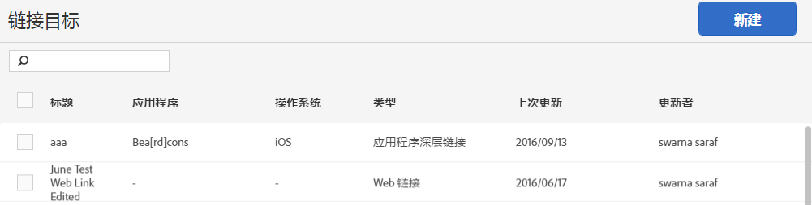

# Manage link destinations{#manage-link-destinations}

您可以使用“链接目标”页面来编辑、存档、取消存档或删除现有目标。

要显示管理链接目标页面，请执行以下操作：

1. In the Mobile Services UI, click **[!UICONTROL Manage Apps]**.
1. 在应用程序的“应用程序信息”页面上，单击“管 **[!UICONTROL 理链接目标”]**。

   

1. （可选）完成以下相应任务：

   * **Edit**

      要编辑某个现有的链接目标，请在列表中单击其名称，然后编辑相关字段。有关更多信息，请参阅 创 [建新链接目标](/help/using/acquisition-main/c-manage-link-destinations/t-create-new-app-deep-link-destination.md)。

      >[!IMPORTANT]
      >
      >这些更改可能需要15分钟才能生效。

   * **存档**

      You can archive link destinations that you want to retain, but you want to remove from the **[!UICONTROL Link Destinations]** list.

      To archive link destinations, select one or more check boxes next to the link names and click **[!UICONTROL Archive Selected]**. 由于您的链接目标已存档，并且可以随时取消存档，因此您无需确认操作。

   * **取消存档**

      如果您想要在链接目标列表中再次显示之前已存档的链接目标，您可以对这些目标进行取消存档。

      要取消存档链接目标，请执行以下操作：

      1. click **[!UICONTROL View Archive]**.
      1. 选中要取消存档的链接名称旁边的一个或多个复选框。
      1. 单击“取 **[!UICONTROL 消存档选定项]**”。
      仅当您之前存档过链接目标，**[!UICONTROL 查看存档]选项才会显示。**

   * **Delete**

      To delete a link destination, select one or more check boxes next to the links you want to delete, click **[!UICONTROL Delete Selected]**, and click **[!UICONTROL Delete]** to confirm your action.

      >[!IMPORTANT]
      >
      >删除链接目标是永久 **性的**。 如果您不确定是否确实要删除某个链接目标，请使用存档选项。

