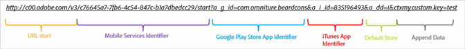
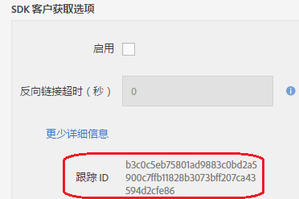

# 手动创建客户获取链接 {#create-acquisition-link-manually}

您可以通过手动配置 URL 参数来创建营销链接，以便即时获取新的移动设备应用程序用户。

>[!IMPORTANT]
>
>此功能需要安装 SDK 版本 4.6 或更高版本。有关更多信息，请参阅[客户获取先决条件](/help/using/acquisition-main/c-acquisition-prerequisites.md)。

下图展示了一个手动构建的跟踪链接的组件，并且还显示了在手动创建客户获取链接时，必须正确配置的不同 URL 参数。

此链接配置为针对移动设备应用程序，执行到 Google Play 应用商店或 Apple App Store 的特定于平台的重定向。如果无法确定目标，则默认存储设置为 Apple App Store。安装应用程序后，`my.custom.key:test` 自定义上下文键会附加到“Analytics 安装点击”。

要手动创建链接，请使用下面的 URL 格式：

`http(s)://c00.adobe.com/v3/ {mobile-services-app-hash}/start? {parameters}`

>[!TIP]
>
>您所使用的 Android SDK 版本对此过程没有影响。

对于 iOS，请确保使用正确的协议：

* 如果您使用的是 iOS SDK 4.7.0 之前的版本，或者如果您使用的是 iOS SDK 4.7.0 或更高版本并且&#x200B;**未**&#x200B;在“管理应用程序设置”页面中选中&#x200B;**[!UICONTROL 使用 HTTPS]**，则使用 **HTTP**。
* 如果您使用的是 iOS SDK 4.7.0 或更高版本并且已&#x200B;**在“管理应用程序设置”页面中选中**&#x200B;使用 HTTPS ****，则使用 **HTTPS**。

在满足下列条件的情况下：

* `{mobile-services-app-hash}` 与配置 `acquisition:appid ` 文件中的应用程序标识符匹配。

   您可以在“管理应用程序设置”页面中找到 `{mobile-services-app-hash}`，它位于“跟踪 ID”字段中的“客户获取 SDK 选项”下方。

   

* `{parameters}` 是专门指定的标准 URL 查询参数列表。

以下是参数列表：

* **`a_g_id`**

   Google Play Store 应用程序标识符。

   * 示例值：`com.adobe.beardcons`

* **`a_g_lo`**

   Google Play Store 区域覆盖。

   * 示例值：`ko`

* **`a_i_id`**

   iTunes 应用程序标识符。

   * 示例值：`835196493`

* **`a_i_lo`**

   iTunes 区域覆盖。

   * 示例值：`jp`

* **`a_dd`**

   自动重定向的默认商店。

   * 示例值：`i | g`

* **`a_cid`**

   自定义 ID 覆盖（通常，对于 iOS，为 IDFA；对于 Android，则为 ADID）。

   * 示例值：`Any String < 255 characters (UTF-8 encoded)`

* **`ctx*`**

   以 `ctx` 为前缀的键将位于结果启动点击的上下文数据中。

   * 示例值：`ctxmy.custom.key=myValue`

* **`ctxa.referrer.campaign.name`**

   客户获取促销活动名称。

   如果要比较不同客户获取链接的性能，此参数是报告所必需的。

   * 示例值：2015 年峰会

* **`ctxa.referrer.campaign.trackingcode`**

   跟踪代码

   如果要比较不同客户获取链接的性能，此参数是报告所必需的。

   * 示例值：`lexsxouj`

* **`ctxa.referrer.campaign.source`**

   来源。

   * 示例值：广告网络

* **`ctxa.referrer.campaign.medium`**

   媒介

   * 示例值：电子邮件

* **`ctxa.referrer.campaign.content`**

   内容

   * 示例值：图像 # 325689

* **`ctxa.referrer.campaign.term`**

   搜索词

   * 示例值：远足+靴子

手动创建客户获取链接时，请记住以下信息：

* 与表中参数不匹配的所有参数都将作为应用商店重定向的一部分传递。
* 从技术上讲，所有参数都是可选的，但应至少指定一个商店 ID，否则该链接将不会起作用。

   `a_g_id`/ `a_i_id` 是商店 ID 的一个示例。

* 如果不能自动确定目标商店，并且没有提供默认值，则会返回 404 错误。

