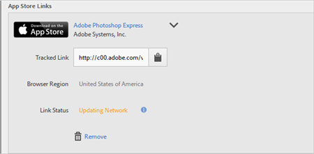

# 创建客户获取链接{#create-an-acquisition-link}

您可以创建应用商店链接，以便能够直接从 Apple App Store 和 Google Play 下载应用程序。通过所创建的这些链接，您可以将成功事件归因于下载。

1. 单击&#x200B;**[!UICONTROL 客户获取]** > **[!UICONTROL 管理客户获取链接]** > **[!UICONTROL 新建]**。
1. 在&#x200B;**[!UICONTROL 链接信息]**&#x200B;部分键入以下信息：

   * （**必需**）**[!UICONTROL 名称]**
为应用程序链接指定一个描述性名称。
   * **[!UICONTROL 跟踪代码]**
指定所需的跟踪代码，或单击**[!UICONTROL 生成]**&#x200B;以创建新的跟踪代码。
   * （**必需**）**[!UICONTROL 来源]**
指定原始反向链接，如“商务通讯”或“主页”。
   * **[!UICONTROL 媒介]**
指定营销媒介，如“横幅广告”或“电子邮件”。
   * **[!UICONTROL 内容]**
指定带有链接的广告的名称或 ID。
   * **[!UICONTROL 搜索词]**
指定广告的付费关键词或其他搜索词。
   >[!IMPORTANT]
   >
   >创建客户获取链接之后，将无法更改以上字段中的值。

1. 在&#x200B;**[!UICONTROL 添加应用商店链接]**&#x200B;部分的字段中键入相应信息。

   * **[!UICONTROL 应用商店]**

      选择一个应用商店：
      * Apple App Store
      * Google Play

      每个应用商店的选项会有所不同，如下所述。

   * **[!UICONTROL 浏览器地区（仅 Apple App Store）]**

      为桌面浏览器指定一个特定的地区性应用商店。

      该设置允许您定义在用户从桌面浏览器单击客户获取链接时，您希望该链接定向到的区域特定应用商店。移动设备基于设备设置自动重定向。

   * **[!UICONTROL 浏览器语言（Google 语言（仅 Google Play））]**

      从下拉列表中选择一种语言。

      此设置允许您为桌面浏览器定义在 Google Play Store 中显示的一种特定语言。移动设备基于设备设置显示语言。

   * **[!UICONTROL 按名称搜索]**

      * 对于 Apple App Store，如果您不知道应用程序 ID，则可以按名称搜索应用程序。

         您可以从&#x200B;**[!UICONTROL 地区]**&#x200B;下拉列表中选择一个可选地区，来限定您的搜索范围。

      * 对于 Google Play，如果您不知道包名称，则可以按名称搜索应用程序名称。
   * **[!UICONTROL 应用程序 ID（仅 Apple App Store）]**

      如果您搜索应用程序，此字段会自动填充。您可以直接键入应用程序 ID 的值，而不搜索应用程序。

   * **[!UICONTROL 包名称（仅 Google Play）]**

      如果您搜索应用程序，此字段会自动填充。您也可以不执行搜索，而是直接键入包名称值。

1. 要保存您的配置并生成链接，请单击&#x200B;**[!UICONTROL 添加]** > **[!UICONTROL 保存]**。

   新创建的链接会显示在&#x200B;**[!UICONTROL 应用商店链接]**&#x200B;部分中。

   

1. 单击  以将跟踪链接复制到剪贴板。

1. 将链接粘贴到您的社交媒体帖子、广告、电子邮件等。
