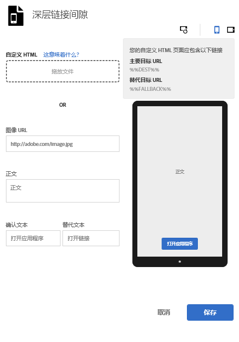

# 间隙{#interstitials}

您可以将用户路由到相应的目标：用户安装了应用程序，则路由到应用程序深层链接；用户没有安装应用程序，则路由到某个网站或应用程序商店。最好让用户自己选择路由到哪个目标。营销人员可以配置一个插播式广告页面，向用户显示可用的着陆目标，以供用户选择。

要在 创建营销链接：

1. Click **[!UICONTROL Edit Deep Link Interstitial]**.

   

1. 在以下字段中键入相应信息：

   * **[!UICONTROL 自定义 HTML]**

      选择您自定义的插播式广告 HTML 页面。

      通过使用自定义插播广告，营销人员可以使用自定义HTML/CSS/JS自定义插播式广告登陆页面，从而使您能够为页面添加品牌。

      以下是对 HTML 页面的要求：

      * 必须是 HTML 文件。
      * Must contain the `%%DEST%%` and `%%FALLBACK%%` placeholders.
      * The uploaded HTML will be served in an `<iframe>`.

         必须确保您的链接目标指向父窗口。You can include `<base target="_parent" />` in `<head>` or specify a target property for each `<a/>` individually.

         >[!TIP]
         >
         >如果上传自定义HTML，则除非删除已上传的文件，否则将不使用此表中的其他四个选项。
   * **[!UICONTROL 图像 URL]**

      指定到图像资产的 URL。

   * **[!UICONTROL 正文文本]**

      指定插播式广告的正文文本。

   * **[!UICONTROL 确认文本]**

      指定文本按钮的文本。

   * **[!UICONTROL 回退文本]**

      指定要显示的回退文本。

      如果深层链接失败，此字段会更新文本按钮。先指引用户尝试深层链接，然后才允许他们回退到其他选项。例如，回退可以是到应用商店下载和安装应用程序或将用户带至公司的网站。回退文本可让用户知道在深层链接失败时还会有其他的选项可用。

1. (**Optional**) Click the icons above the image to see how the interstitial looks rotated and on different devices.

   您可以在 Mobile Services 之外的位置更改或编辑图像，以确保该图像在不同的情况下均能正常显示。
1. 单击&#x200B;**[!UICONTROL 保存]**。
