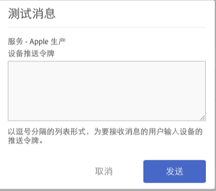

# 启用推送消息的先决条件 {#prerequisites-to-enable-push-messaging}

在应用程序中配置推送消息之前，您必须先完成这些任务。

## 为您的公司启用 Experience Cloud

您的 Adobe Analytics 公司必须已启用 Experience Cloud。您可以与 Adobe 帐户管理员确认此状态。

## 安装和配置 Mobile SDK

* **安装 Mobile SDK**

   要配置推送消息，您必须最低下载并安装 Mobile SDK 版本 4.6 或更高版本。有关更多信息，请参阅[下载 SDK](/help/using/c-manage-app-settings/c-mob-confg-app/t-config-analytics/download-sdk.md)。

* **配置推送服务**

   您必须在 Mobile SDK 中配置推送服务。有关更多信息，请参阅以下内容：

   * [Android 中的推送消息](/help/android/messaging-main/push-messaging/push-messaging.md)
   * [iOS 中的推送消息](/help/ios/messaging-main/push-messaging/push-messaging.md)

## 使用您的 Adobe ID 登录到 Mobile 核心服务

>[!IMPORTANT]
>
>要使用推送服务功能，用户必须使用他们的 Adobe ID 登录到 Mobile 核心服务，而且他们的 Analytics 帐户必须关联到他们的 Adobe ID。如果用户使用其现有的 Adobe Analytics 帐户登录，则推送服务功能将不可用。

如果用户没有 Adobe ID，请完成以下步骤：

1. （**Experience Cloud 管理员**）邀请用户加入 Experience Cloud。

1. （**用户**）使用 Experience Cloud 管理员提供的操作说明创建个人 Adobe ID。

   管理员完成上一步骤后，系统会自动向每个用户发送电子邮件消息。

1. （**用户**）使用他们的 Adobe ID 登录到 Mobile。

## 在 Experience Cloud 中关联用户帐户

每个用户必须关联 Experience Cloud 组织内的 Analytics 解决方案帐户。

1. 要使用 Adobe ID 登录到 Experience Cloud，请在浏览器中键入 [https://marketing.adobe.com](https://marketing.adobe.com)。

1. 选择位于右上角的 Analytics 公司名称。

1. 单击&#x200B;**[!UICONTROL 添加组织]**，然后从下拉列表中选择 **[!UICONTROL Adobe SiteCatalyst/Adobe Social]**。

1. 键入公司名称和您登录此公司的旧凭据，然后单击&#x200B;**[!UICONTROL 关联帐户]**。

   Adobe ID 现在已关联到您的 Analytics 帐户、公司和登录凭据。

有关详细信息，请参阅[排查帐户关联问题](https://docs.adobe.com/content/help/zh-Hans/core-services/interface/manage-users-and-products/organizations.html)。

## 在 Mobile 用户界面中配置推送服务和 SDK ID 服务

在为您的应用程序启用 ID 服务之前，**[!UICONTROL 推送服务]**&#x200B;部分处于禁用状态。但是，启用 ID 服务后，“推送服务”部分即会启用。有关启用推送服务的更多信息，请参阅[配置 SDK ID 服务选项](/help/using/c-manage-app-settings/c-mob-confg-app/t-config-visitor.md)。

>[!IMPORTANT]
>
>您必须单击&#x200B;**[!UICONTROL 保存]**&#x200B;以保存所做更改，然后刷新推送服务。
>
>您可以在每个报表包中配置一个用于 Apple 的应用商店应用程序和一个用于 Google 的应用商店应用程序。如果您需要其他应用商店应用程序，例如，一个用于生产环境的应用商店应用程序和一个用于开发环境的应用商店应用程序，请为每个环境分别设置一个新的应用商店应用程序和一个新的报表包。

* 对于 **Apple**：拖放您的私钥和/或证书。如果您的私钥是经过密码加密的，请键入其密码。

   * 对于&#x200B;**私钥**：将您的私钥拖放到框中。

      您还可以单击&#x200B;**[!UICONTROL 浏览]**&#x200B;以选择该文件。此文件包含私钥。证书可能也包含在此文件内（`.p12`、`pkcs12`、`.pfx`、`.key`、`.pem`）。

   * 对于&#x200B;**私钥密码**：如果私钥文件已加密，请键入密码。

      （视情况而定）对于&#x200B;**证书**：将您的证书文件拖放到框中。您还可以单击&#x200B;**[!UICONTROL 浏览]**&#x200B;以选择该文件。如果私钥文件也包含证书（`.cert`、`.cer`、`.crt`、`.pem`），则不需要填写此字段。

* 对于 **Google**：指定应用程序的 API 密钥。

   单击&#x200B;**[!UICONTROL 测试]**&#x200B;以验证是否已正确配置应用程序和 Mobile Services。此选项对于调试和故障排除非常有用。

   键入要用于发送消息的设备推送令牌。您可以在一个以逗号分隔的列表中指定令牌，以便向多个设备发送消息。

   
