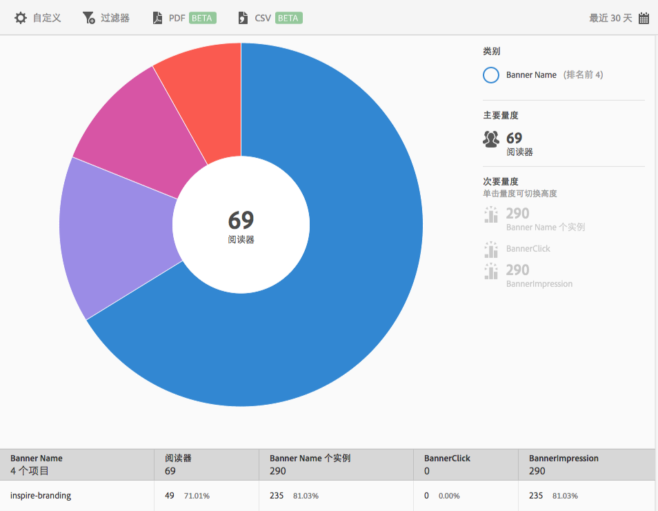

# 横幅量度 {#banner-metrics}

**[!UICONTROL 横幅量度]**&#x200B;报表会针对您的现有数据显示一个环状层次视图。此报表仅供 Digital Publishing Suite (DPS) 客户使用。

默认情况下，此报表会显示以下量度：

* **[!UICONTROL 横幅名称]**，横幅的名称。
* **[!UICONTROL 读者数]**，应用程序用户的数量。
* **[!UICONTROL 横幅名称出现次数]**，通过点击和展示引用横幅的次数。
* **[!UICONTROL 横幅点击次数]**，用户点击横幅的次数。
* **[!UICONTROL 横幅展示次数]**，在浏览器页面上查看（或显示）横幅的次数。

此报表类似于&#x200B;**[!UICONTROL 技术]**&#x200B;报表。有关如何完成以下操作的信息：导航和使用环状层次报表、添加划分和量度、创建目标活动、创建置顶过滤器以及共享报表，请参阅[技术](/help/using/usage/reports-technology.md)。可以使用此主题中的信息来自定义&#x200B;**[!UICONTROL 横幅量度]**&#x200B;报表。
