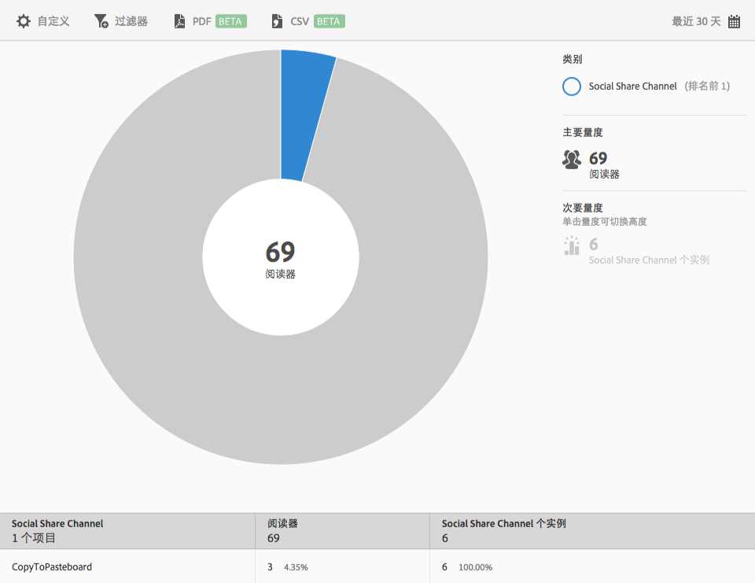

# 社交共享{#social-sharing}

**[!UICONTROL 社交共享]**&#x200B;报表会针对您的现有数据显示一个环状层次视图。此报表仅供 DPS 客户使用。

默认情况下，此报表会显示通过不同渠道（例如电子邮件、消息等）共享文章的读者数量。

此报表类似于&#x200B;**[!UICONTROL 技术]**&#x200B;报表。有关如何完成以下操作的信息：导航和使用环状层次报表、添加划分和量度、创建目标活动、创建置顶过滤器以及共享报表，请参阅[技术](/help/using/usage/reports-technology.md)。可以使用“技术”主题中的信息来自定义&#x200B;**[!UICONTROL 社交共享]**&#x200B;报表。
