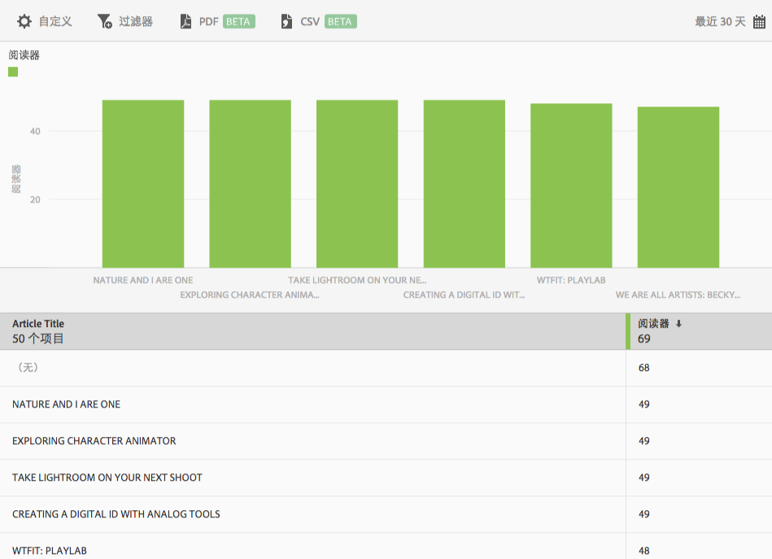

# “前 50 篇文章”报表{#top-articles}

**[!UICONTROL 前 50 篇文章]**&#x200B;报表显示一个条形图形式的排名报表，其中显示了通过应用程序阅读次数最多的文章。此报表仅供 DPS 客户使用。

虽然默认报表显示过去 30 天的读者数，但您可以自定义该报表。

默认情况下，此报表会显示文章标题和读者数量。

您可以为此报表配置以下选项：

* **[!UICONTROL 时间段]**
单击**[!UICONTROL 日历]**&#x200B;图标可选择自定义时间段，或从下拉列表中选取预设时间段。

* **[!UICONTROL 自定义]**

   通过更改&#x200B;**[!UICONTROL 显示方式]**&#x200B;选项、添加量度和过滤器，以及添加其他系列（量度）等自定义您的报表。有关更多信息，请参阅[自定义报表](/help/using/usage/reports-customize/reports-customize.md)。

* **[!UICONTROL 过滤器]**

   单击&#x200B;**[!UICONTROL 过滤器]**&#x200B;可创建跨不同报表的过滤器，以便查看区段在所有移动设备报表中的执行情况。置顶过滤器允许您定义应用于所有非路径报表的过滤器。有关更多信息，请参阅[添加置顶过滤器](/help/using/usage/reports-customize/t-sticky-filter.md)。

* **[!UICONTROL 下载]**

   单击 **[!UICONTROL PDF]** 或 **[!UICONTROL CSV]** 可下载或打开文档，并与无法访问 Mobile Services 的用户共享，或者在演示文稿中使用该文件。
