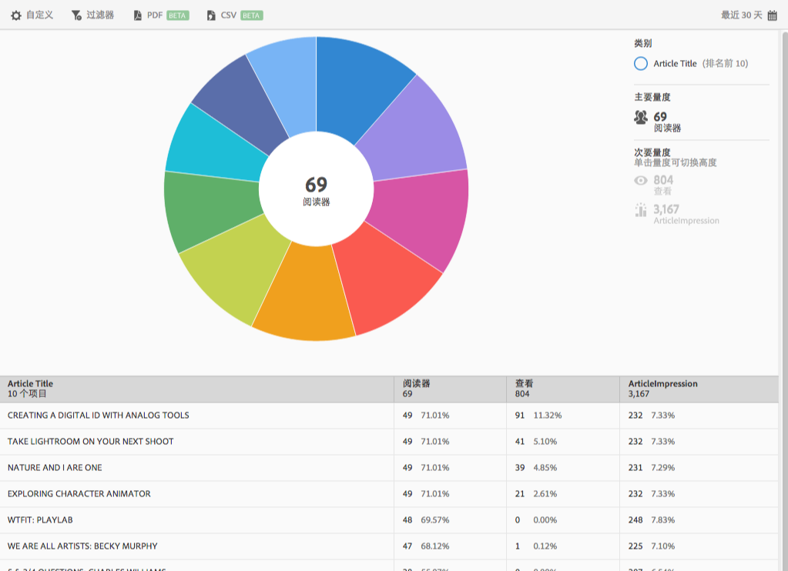

# “前 10 篇文章”报表{#top-articles}

**[!UICONTROL 前 10 篇文章]**&#x200B;报表会针对您的数据显示一个环状层次视图。此报表仅供 DPS 客户使用。

默认情况下，此报表显示文章标题、读者数和占总读者数的百分比，以及文章标题出现次数和百分比。

此报表类似于&#x200B;**[!UICONTROL 技术]**&#x200B;报表。有关如何完成以下操作的信息：导航和使用环状层次报表、添加划分和量度、创建目标活动、创建置顶过滤器以及共享报表，请参阅[技术](/help/using/usage/reports-technology.md)。此信息可用于自定义&#x200B;**[!UICONTROL 前 10 篇文章]**&#x200B;报表。
