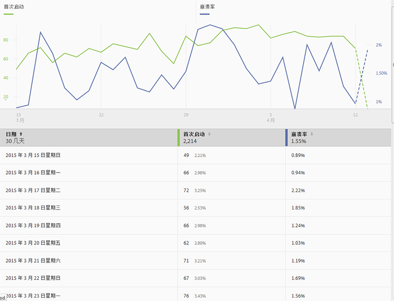
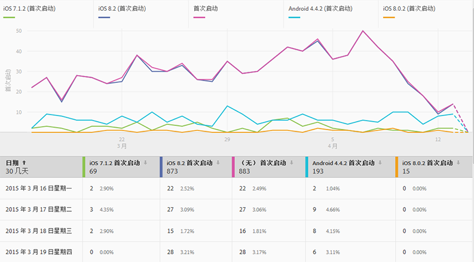
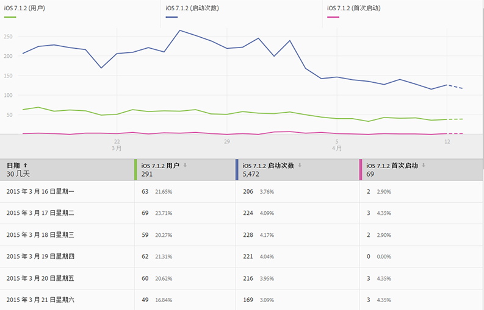
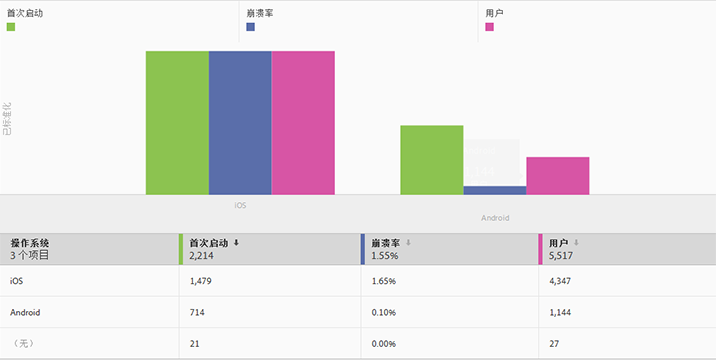
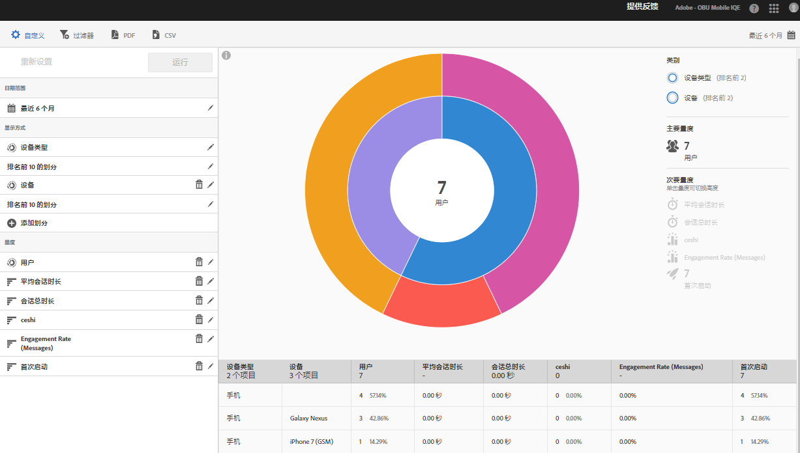
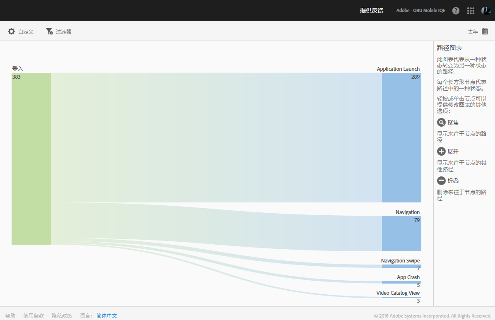
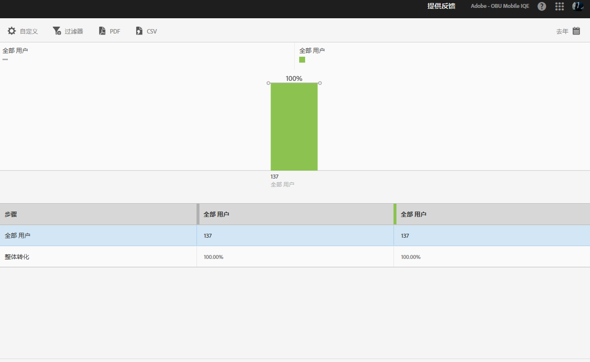

# 报表类型 {#report-types}

在自定义报表时，广泛的灵活性可能会导致产生一些问题，从而难以确定哪种报表类型最适合获取您所需的数据。

在自定义报表之前，您必须了解量度与维度之间的区别。

* 量度

   量度用于测量您的数据。量度是可计数和添加的值，可用于查看特定操作在应用程序中发生的频率。常用量度包括安装次数、启动次数、收入、生命周期值和登录次数。例如，每次启动应用程序时，_launches_value 都会增加 1。

* 维度

   维度用于描述您的数据。维度采用字符串或在行为上类似于字符串的数字（例如邮政编码）来表示，用于组织和划分您的数据。常见维度示例包括操作系统版本、促销活动名称、产品名称和移动运营商。每个维度都包含许多与该维度关联的特定值。例如，操作系统版本维度具有 _iOS 7_ 和 _Android 4.1.2_ 之类的值。

以下是可以在 Mobile UI 中生成的报表类型：

## 特定时段报表 {#section_2741DA54C90C49AFB17C7B9BC7AD627D}

特定时段报表会显示量度在某个时间范围内的执行情况，以便您可以快速识别峰值和趋势。通常从特定时段报表开始分析，并在您深入调查对可能导致流量激增或量度趋势的因素，转到趋势报表和排名报表。

例如，如果您看到启动次数出现峰值，则可能会运行一个趋势报表来显示排名前 5 的操作系统的启动次数，以了解哪些操作系统对启动次数峰值的贡献最大：

要在特定时段报表上查看涉及其他量度的维度值，您可以使用实例量度并定义维度过滤器。

## 趋势报表 {#section_C9BE9A2EDBFF4D938B9AF14C8AA67883}

趋势报表可帮助您了解最受欢迎的维度对量度的执行效果。您可以使用此报表来确定哪些值对量度更改的贡献最大。

要查看某个维度的趋势报表，请向特定时段报表添加一个置顶过滤器（例如，操作系统 = iOS 6.0.1）以查看相同数据。还有一样好处，您可以向已过滤的特定时段报表添加五个额外的量度。

## 已过滤的特定时段报表 {#section_F8FAF2A4496F449CA99EF1E052C71A2D}

如果您想要查看特定的维度值，可向特定时段报表添加一个置顶过滤器。以下报表会显示特定操作系统版本 30 天的有效启动次数、升级次数和崩溃次数。

## 排名报表 {#section_C073D744A95843AF99EE74FB5B013735}

排名报表会显示排名前 50 的维度对量度的贡献频率。当在大量值中查看某个日期范围内的总贡献时，此报表非常有用。

## 环状层次报表 {#section_17A9842039174DE094A6B1E9837E35BB}

环状层次图报表提供基本报表以及划分等内容。这种可视化图表使用高度来显示量度以及不同量度之间的性能差异。每个同心圆代表该圆圈类别中的受众区段。您可以对受众执行各种操作，例如应用置顶过滤器、隐藏量度，以及查看量度。

您可以查看产品教程中的报表，其中介绍了如何与环状层次图进行交互。

要开始使用教程，请执行以下操作：

1. 在“管理应用程序设置”中，单击&#x200B;**[!UICONTROL 使用情况]**。

1. 单击&#x200B;**[!UICONTROL 技术]** > **[!UICONTROL 技术划分]**。
1. 单击报表标题栏中的&#x200B;**[!UICONTROL 自定义]**，然后单击信息图标。

### 路径报表 {#section_AD400106BC684B50B27CCCD3F4497114}

路径报表基于路径分析，会显示一个路径图来表示在应用程序中从一个状态到另一个状态所采用的路径。

每个节点的形状像是一个框，都表示用户路径通过应用程序时的一种状态。例如，在上图中，顶级节点表示启动应用程序并从图片库选择照片的用户数量。

### “漏斗”报表  {#section_AF3B0C899D844FC3AD1F91A2C452C92F}

漏斗报表让您能够识别在与移动设备应用程序交互时，客户在何处放弃促销活动或偏离定义的转化路径。您还可以使用漏斗报表来比较不同区段的操作。

漏斗可视化图表让您能够了解客户从流程中流失的位置。监控每个步骤的客户决策可让您了解客户在哪里受到阻碍，他们倾向于关注哪条路径，以及客户何时离开您的应用程序。

