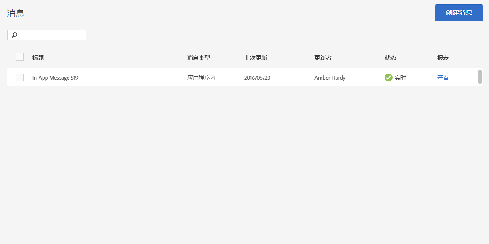

# 管理消息{#manage-messages}

查看应用程序内消息和推送消息列表，以及有关每个消息的上次更新时间和处于何种状态（活动还是已停用）的详细信息。

您可以复制、激活/停用和存档/取消存档消息。您还可以查看相关报表，了解已查看消息的用户数量以及已点进消息的用户数量。

要管理消息，请单击 ***your_app_name*** &gt; **[!UICONTROL 消息传送]** &gt; **[!UICONTROL 管理消息]**。

以下是有关可在消息中完成的各项任务的更多信息：

* **搜索和过滤消息**

   使用列表顶部的搜索框来搜索和过滤消息。您在搜索框中键入的任何内容都会显示来自列表中的匹配消息。搜索可在所有表格列中进行。例如，您可以键入`Draft`以仅显示具有此状态的消息。您还可以键入用户的名称以便仅显示由该用户更新的消息。

   除了搜索框之外，您还可以单击任何列标题以按该列的内容对列表进行升序或降序排序。

   例如，如果您对&#x200B;**[!UICONTROL 消息类型]列进行升序排序，则您所有的应用程序内消息会在您的推送消息之前显示。**&#x200B;如果您对&#x200B;**[!UICONTROL 上次更新]列进行降序排序，则您最近更新的消息将显示在列表最上方。**

* **复制消息**

   1. 选中一条或多条消息旁边的复选框，然后单击&#x200B;**[!UICONTROL 复制选定项]**。
   1. 选择要为其复制消息的应用程序。
   1. 键入消息名称。

      要为同一个应用程序复制某条消息，请为该消息键入一个新名称：如果保留相同的名称，则会覆盖原始消息。如果您为不同的应用程序复制消息，则可以保留相同的名称，而不会覆盖原始消息。

   1. 根据需要，单击&#x200B;**[!UICONTROL 复制]**&#x200B;或&#x200B;**[!UICONTROL 覆盖]**。

* **停用或激活消息**

   要停用消息，请至少选中一条活动消息旁边的复选框，然后单击&#x200B;**[!UICONTROL 停用选定项]**。

   要激活已停用的消息，请至少选中一条已停用消息旁边的复选框，然后单击&#x200B;**[!UICONTROL 激活选定项]**。

* **存档消息**

   要将消息存档并对消息列表进行清理，请执行以下操作：

   >[!TIP]
   >
   >在将消息存档前，您必须先将其停用。

   1. 至少选中一条已停用消息旁边的复选框，然后单击&#x200B;**[!UICONTROL 存档选定项]**。

* **查看存档消息**

   1. 单击&#x200B;**[!UICONTROL 查看存档]**。
   1. 至少选中一条已存档消息旁边的复选框，然后单击&#x200B;**[!UICONTROL 取消存档选定项]**。

