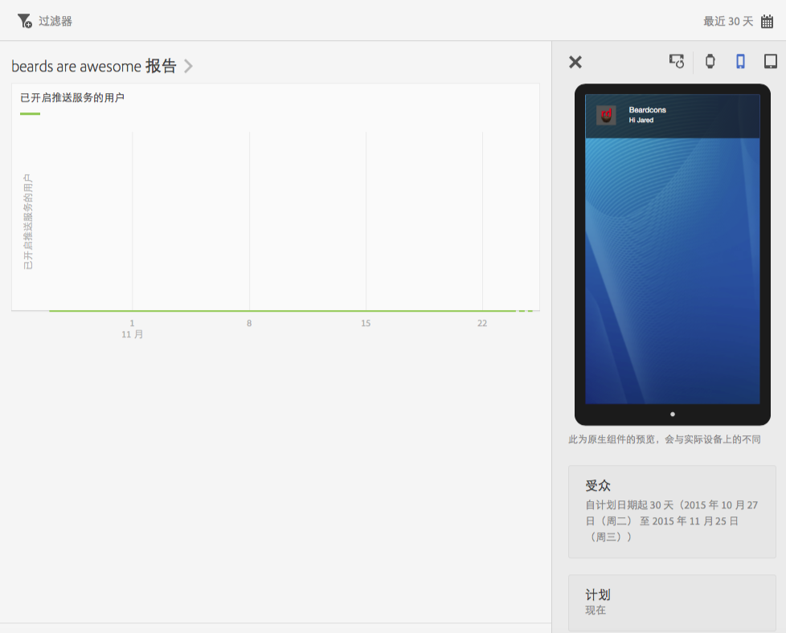
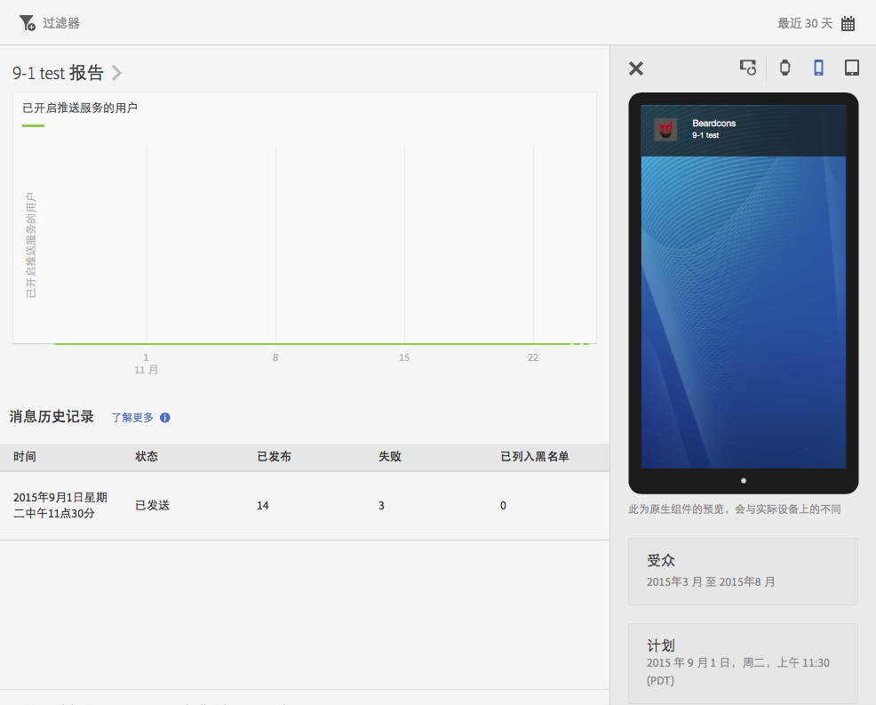

# 查看消息报表{#view-message-reports}

您可以查看应用程序内消息和推送消息的消息报表。

1. 单击某个消息列中的 **[!UICONTROL 报表图标]**。
1. （**可选**）为报表创建置顶过滤器，或通过单击&#x200B;**[!UICONTROL 日历]**&#x200B;图标来更改时间段。

   有关创建置顶过滤器的更多信息，请参阅[添加置顶过滤器](/help/using/usage/reports-customize/t-sticky-filter.md)。

>[!TIP]
>
>根据您查看的消息类型，报表可能会有所不同。

## 应用程序内消息 {#section_90B79BA58E8141F78538C187EB1BF8C7}

如果您查看的是应用程序内消息的报表，则该报表类似于以下插图：

### 应用程序内消息量度

以下是可用于应用程序内消息的量度列表：

* **[!UICONTROL 展示]**，消息触发时。

* **[!UICONTROL 点进]**，用户按下警报或全屏消息上的&#x200B;**[!UICONTROL 点进]**&#x200B;按钮时，以及用户从本地通知中打开应用程序时。

* **[!UICONTROL 取消]**，用户按下警报或全屏消息上的&#x200B;**[!UICONTROL 取消]**&#x200B;按钮时。

* **[!UICONTROL 参与率]**，这是 Adobe Analytics 的一种计算量度，它是用点进次数除以展示次数得来的。

## 推送消息 {#section_BEAFD858CA194185B6F88903446058E9}

如果您查看的是推送消息的报表，则该报表类似于以下插图：

顶部的图表显示了已打开消息的用户数量。

### 推送消息量度

以下是可用于推送消息的量度列表：

* **[!UICONTROL 时间]**

   将消息从 Mobile Services 推送到设备的时间。

* **[!UICONTROL 状态]**

   消息的状态，可用状态包括：

   * **[!UICONTROL 已取消]**
   * **[!UICONTROL 已计划]**
   * **[!UICONTROL 正在执行]**
   * **[!UICONTROL 已执行]**

* **[!UICONTROL 已发布]**

   成功发送到 Apple 推送通知服务/Firebase Cloud Messaging (APNS/FCM) 以将消息发送到用户设备的设备令牌数量。

* **[!UICONTROL 失败]**

   未成功发送到 APNS/FCM 的设备令牌数量。一些可能导致失败的原因有：

   * pushID 无效

   * 给定的用来接收令牌的推送平台（APNS、FCM 等）不具备可执行此任务的相应设置。例如，平台可能会收集 iOS 推送令牌，但并未配置 APNS 服务。

   * 由于推送服务配置不正确或 Mobile Services 系统关闭，消息可能会失败。
   >[!IMPORTANT]
   >
   >如果出现异常多的故障，请检查您的推送服务配置。如果推送服务配置正确，请与 Adobe 客户关怀团队联系。

* **[!UICONTROL 已列入阻止列表]**

   不能再被发送到 APNS 或 FCM 的设备令牌数量。这通常意味着该应用程序已从设备中卸载，或用户更改了用来接收消息的选择启用设置。关于令牌何时会计入阻止列表这个问题，Android 和 iOS 存在差异。Android 令牌会立即显示在阻止列表计数中。iOS 令牌最初显示为已发布，但根据 APNS 的反馈，会在后续消息中显示为阻止。
