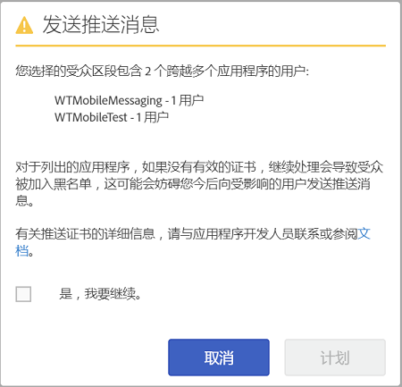

# 受众：推送消息{#audience-define-and-configure-audience-segments-for-push-messages}

您可以为推送消息定义和配置受众选项，包括日期范围选项、Analytics 区段和自定义区段。

## 定义受众区段 {#section_7C4D2393CF7441959FE2381A02867CAC}

当创建用于推送消息的受众区段时，该区段可能涉及来自一个或多个应用程序的用户，因为报表包或虚拟报表包可能包含来自一个或多个应用程序的数据。有关虚拟报表包的更多信息，请参阅[虚拟报表包](/help/using/manage-apps/c-mob-vrs.md)。

在 Adobe Mobile Services 中，营销人员可能只将消息推送到每个平台的一个应用程序。如果营销人员尝试将消息推送到包含来自多个应用程序的用户的区段，则会显示一条警告，指出继续操作可能会导致严重的推送故障并可能将用户列入阻止列表。如果您遇到推送故障，请参阅[排查推送消息问题](/help/using/in-app-messaging/t-create-push-message/c-schedule-push-message.md)中的&#x200B;*解决推送消息失败问题*。

要在区段定义中使用 Audience Manager 数据，请参阅[受众分析](https://docs-author-stg.corp.adobe.com/content/help/en/analytics/integration/audience-analytics/mc-audiences-aam.html)。

>[!IMPORTANT]
>
>如果应用程序用户被列入阻止列表，则营销人员再也&#x200B;**不**&#x200B;能向这些受影响的用户发送推送消息。

如果您选择的受众区段包含跨多个应用程序的用户，则可能会看到以下提醒：

应用程序名称基于 appId 的精简版，由 Mobile Services SDK 以 `<app name> <version number> (<bundle id>)` 格式自动发送到 Adobe Analytics。

>[!TIP]
>
>版本号为可选参数。

最多会删除版本的 6 组编号和包 ID 的 5 组编号。

例如：

* `Bea[rd]cons 1.0 (123)` 将显示为 `Bea[rd]cons`
* `Bea[rd]cons 1.2 (1.2)` 将显示为 `Bea[rd]cons`
* `Bea[rd]cons 1.2.3.4.5.6.7 (1111)` 将显示为 `Bea[rd]cons .7`
* `Bea[rd]cons 1.2.3. (1.2.3.4.5.6)` 将显示为 `Bea[rd]cons (.6)`

要继续将推送消息发送到列出的应用程序，请选择&#x200B;**[!UICONTROL 是，我要继续。]**&#x200B;复选框，然后单击&#x200B;**[!UICONTROL 发送]**。

## 最佳实践

请牢记以下一些最佳实践：

* 为了减少混淆，应&#x200B;**避免**&#x200B;定义包含多个应用程序中数据的移动设备应用程序虚拟报表包。
* **每次**&#x200B;要发送推送消息时，在受众区段中使用唯一的应用程序 ID。这可确保将推送通知发送到&#x200B;**仅**&#x200B;属于一个应用程序的受众区段。

### 示例

以下是有助于您了解如何正确定义区段的一些示例：

**可以做**：营销人员为某个应用程序（例如，Adobe Photoshop）的 iOS 和 Android 版本提供推送证书。营销人员可能会向跨两个平台的用户区段发送推送通知。

**不可以做**：营销人员为某个应用程序（例如，Adobe Photoshop）的 iOS 和 Android 版本提供推送证书。如果营销人员创建“过去 30 天内所有活动的用户”**&#x200B;区段并向该区段推送消息，则仅 Adobe Photoshop iOS 和 Android 版应用程序的用户会收到推送消息，而所有 Adobe Illustrator iOS 和 Android 版应用程序用户都将被列入阻止列表。有关更多详细示例，请参阅[排查推送消息问题](/help/using/in-app-messaging/t-create-push-message/c-troubleshooting-push-messaging.md)中的&#x200B;*解决推送消息失败问题*。

## 配置受众区段 {#section_A92C60885A30421B8150820EC1CCBF13}

1. 转到“受众”页面以获取新的推送消息。

   有关更多信息，请参阅[创建推送消息](/help/using/in-app-messaging/t-create-push-message/t-create-push-message.md)。

   在配置受众选项时，请记住以下“重要”****&#x200B;信息：

   * **[!UICONTROL 预计的选择启用受众]**&#x200B;是指与 Adobe Analytics 区段匹配的设备数量&#x200B;**和**&#x200B;选择启用的设备数量。

      您可以查看选定区段中已选择接收消息并将收到推送消息的用户预计数量。无论选择启用状态如何，应用程序用户总数都会显示在预计数量下方。

   * **[!UICONTROL 合计]**&#x200B;是与 Adobe Analytics 区段匹配的设备数量。

   * 推送消息会被发送到定义的 Adobe Analytics 区段所包含的设备&#x200B;**以及**&#x200B;已选择启用推送消息的设备。

      这意味着 SDK 为推送消息选择启用 evar 发送了值 `True`。

   * 即使设备具有有效的设备令牌，但除非 Adobe Analytics 设置了选择启用标志，否则不会将消息推送至该设备。

   * 有关排查推送消息问题的更多信息，请参阅以下内容：

      * [iOS 中的推送消息](https://docs.adobe.com/content/help/zh-Hans/mobile-services/ios/messaging-ios/push-messaging/push-messaging.html)

      * [Android 中的推送消息](https://docs.adobe.com/content/help/zh-Hans/mobile-services/android/messaging-android/push-messaging/push-messaging.html)

1. 在以下字段中键入相应信息：

   * **[!UICONTROL 时段]**

      键入将用于预计受众的时间范围。从&#x200B;**[!UICONTROL 时段:]** 下拉列表中选择一个属性：

   * **[!UICONTROL 最近]**&#x200B;允许您从计划推送消息的时间中选择一个相对的时间范围（例如，最近 7 天、最近 30 天或最近 60 天）。

      例如，如果您选择最近 30 天，并计划在 10 月 31 日推送消息，则预计受众将是选择在 10 月 31 日前 30 天内接收推送消息的用户数量。

   * **[!UICONTROL 静态范围]**&#x200B;允许您通过选取预计受众范围的起始和结束日期，来选择一个静态范围。

      对于上述示例，如果您选择起始于 10 月 1 日并结束于 10 月 15 日的日期范围，但计划在 10 月 31 日推送消息，预计受众将是选择在您指定的静态日期范围内（10 月 1 日至 10 月 15 日）接收推送消息的用户数量。

   * **[!UICONTROL Analytics 区段]**

      从下拉列表中选择一个现有的 Adobe Analytics 区段。有关更多信息，请参阅[构建区段](https://docs.adobe.com/content/help/zh-Hans/analytics/components/segmentation/segmentation-workflow/seg-build.html)。

   * **[!UICONTROL 自定义区段]**

      从下拉列表中选择一个量度或变量（例如，**[!UICONTROL 上次使用后间隔天数]**&#x200B;或&#x200B;**[!UICONTROL 目标点]**），然后根据需要配置过滤器。例如以下自定义区段目标用户，他们拥有运行 iOS 的手机并位于加利福利亚（美国）地区之内。
   >[!IMPORTANT]
   >
   >在&#x200B;**[!UICONTROL 创建受众]**&#x200B;部分中，如果您单击&#x200B;**[!UICONTROL 和]**，系统会显示一个对话框，提醒您确保列出的每个应用程序都&#x200B;**必须**&#x200B;拥有一个有效证书。如果您单击&#x200B;**[!UICONTROL 或]**，则会出现默认对话框。有关有效证书和报表包的更多信息，请参阅[虚拟报表包](/help/using/manage-apps/c-mob-vrs.md)。
