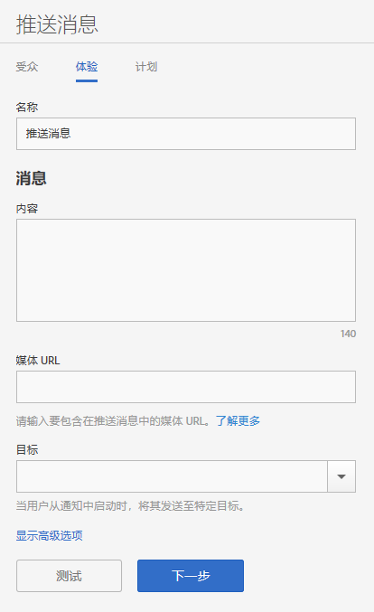

# 体验：推送消息 {#experience-push-message}

您可以为推送消息和富推送消息配置体验选项，包括名称、消息文本和目标选项。您还可以配置高级选项，包括负载选项和适用于 iOS 设备的自定义选项。

1. 在新推送消息的“受众”页面上，单击&#x200B;**[!UICONTROL 体验]**。

   

1. 为此消息键入一个名称。
1. 在&#x200B;**[!UICONTROL 消息]**&#x200B;部分的以下字段中键入相应信息：

   * **[!UICONTROL 内容]**

      指定消息的文本内容。最多可指定 140 个字符。

   * **[!UICONTROL 媒体 URL]**

      键入您计划在推送通知消息中使用的媒体文件 URL。有关使用富推送通知的要求，请参阅下面的“富推送通知的要求”**。

      >[!IMPORTANT]
      >
      >要在推送通知中显示图像或视频，请记住以下内容：
      > * `attachment-url` 数据在推送负载中进行处理。
      > * 媒体 URL 必须能够处理峰值请求。

   * **[!UICONTROL 目标]**

      指定一个特定目标（如 Web、深层链接或混合链接）以在用户点进消息时将用户发送到该目标。有关更多信息，请参阅[目标](/help/using/acquisition-main/c-create-destinations.md)。

      >[!TIP]
      >
      >当您使用 * **[!UICONTROL Web 链接]**&#x200B;或&#x200B;**[!UICONTROL 自定义链接]**&#x200B;目标类型时，不会跟踪该目标类型。仅跟踪&#x200B;**[!UICONTROL 深层链接]**。

## 富推送通知的要求

以下是发送富推送通知的要求：

* **支持的版本**

   以下版本支持富推送通知：
   * Android 4.1.0 或更高版本
   * iOS 10 或更高版本

      >[!IMPORTANT]
      >
      >请牢记以下信息：
      >* 发送到早期版本的富推送消息仍将被发送，但只会显示文本。
      >* 当前不支持手表。

* **文件格式**

   以下是受支持的文件格式：
   * 图像：JPG 和 PNG
   * 动画（仅限 iOS）：GIF
   * 视频（仅限 iOS）：MP4

* **URL 格式**
   * 仅限 HTTPS

* **大小**
   * 图像必须是 2:1 格式，否则将会被裁剪。

有关配置富推送通知的更多信息，请参阅以下内容：

* [在 Android 中接收推送通知](/help/android/messaging-main/push-messaging/c-set-up-rich-push-notif-android.md)
* [在 iOS 中接收富推送通知](/help/ios/messaging-main/push-messaging/c-set-up-rich-push-notif-ios.md)

要在“体验”页面上配置推送消息，请执行以下操作：

1. （**可选**）单击&#x200B;**[!UICONTROL 显示高级选项]**&#x200B;链接以配置其他选项：

   * **[!UICONTROL 负载：数据]**

      提供 JSON 格式的自定义推送负载，该负载将通过推送通知或本地通知发送到应用程序。Android 和 iOS 的大小限制是 4 KB。

   * **[!UICONTROL Apple 选项：类别]**

      为推送和本地通知提供一个类别。有关更多信息，请参阅“iOS 开发人员库”**&#x200B;中的[管理应用程序通知支持](https://developer.apple.com/library/content/documentation/NetworkingInternet/Conceptual/RemoteNotificationsPG/SupportingNotificationsinYourApp.html#//apple_ref/doc/uid/TP40008194-CH4-SW9)。

   * **[!UICONTROL Apple 选项：声音]**

      在您的应用程序包中提供要播放的声音文件的名称。如果未设置此选项，则播放默认的警报声。有关更多信息，请参阅“iOS 开发人员库”中的[管理应用程序通知支持](https://developer.apple.com/library/content/documentation/NetworkingInternet/Conceptual/RemoteNotificationsPG/SupportingNotificationsinYourApp.html#//apple_ref/doc/uid/TP40008194-CH4-SW10)**。

   * **[!UICONTROL Apple 选项：可用内容]**

      选择此选项，以便在有消息到来时，iOS 唤醒位于后台的应用程序并允许它根据消息负载执行代码。有关更多信息，请参阅“iOS 开发人员库”**&#x200B;中的 [Apple 推送通知服务](https://developer.apple.com/library/content/documentation/NetworkingInternet/Conceptual/RemoteNotificationsPG/APNSOverview.html#//apple_ref/doc/uid/TP40008194-CH8-SW1)。

1. （可选）单击以下图标，预览消息的布局：

   * **[!UICONTROL x 摘要]**

      隐藏预览窗格。单击  以再次显示预览窗格。

   * **[!UICONTROL 更改方向]**

      要将预览的方向从纵向更改为横向模式，请单击 。对于手表，方向从圆形表盘更改为方形表盘。

   * **[!UICONTROL 在用户的手表上预览]**

      要预览显示在用户手表上的消息，请单击 。

   * **[!UICONTROL 在用户的手机上预览]**

      要预览显示在用户手机上的消息，请单击 。

   * **[!UICONTROL 在用户的平板电脑上预览]**

      要预览显示在用户平板电脑上的消息，请单击 。
   在预览窗格的底部，您可以查看上一步所选受众的描述。

1. （**可选**）单击&#x200B;**[!UICONTROL 测试]**，以将消息推送至指定的设备来进行测试。
1. 选择相应服务，并键入要将消息推送到的至少一个设备的推送令牌。

   如果要将消息推送到多个设备，请以逗号分隔的列表形式指定这些设备的令牌。

1. 配置消息的计划选项。

   有关更多信息，请参阅[计划：推送消息](/help/using/in-app-messaging/t-create-push-message/c-schedule-push-message.md)。
