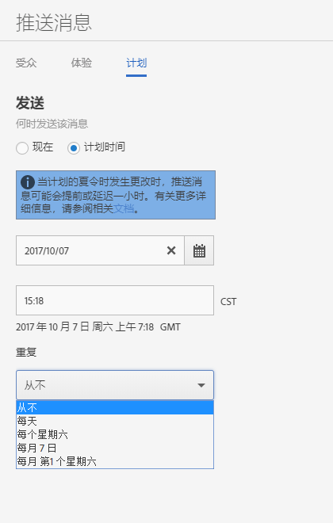

# 计划：推送消息{#schedule-push-message}

在 Adobe Mobile Services UI 中，您可以将推送消息安排为立即发送、稍后发送，以及循环事件。这些事件可以按每日、每周或每月定期执行。

>[!TIP]
>
>用户可以随时修改推送消息作业的计划设置。如果没有适用的日期来发送计划的定期信息，例如，假设每个月的 31 日要发送一份定期信息，那么 2 月 31 日或当月第 5 个星期二时，不会发送信息。

请牢记以下信息：

* 正确的日期和时间格式为 `hh:mm` 和 `mm/dd/yyyy`。

* 您可以通过以下方式编辑计划的消息：

   * 将日期更改为将来的日期。
   * 将重复时间间隔更改为另一个时间间隔。

      例如，如果您最初设置的时间间隔是每天发送消息，则可以将其切换为每周发送。

## 在计划定期推送消息之前

在计划定期推送消息之前，您&#x200B;**必须**&#x200B;了解以下信息：

* **[!UICONTROL 重复]**&#x200B;下拉列表中显示的选项取决于您键入或选择的日期。

   例如，如果您键入了 `Saturday, October 7`，则会显示以下选项：

   * **[!UICONTROL 从不]**
   * **[!UICONTROL 每天]**
   * **[!UICONTROL 每个星期六]**
   * **[!UICONTROL 每月 7 日]**
   * **[!UICONTROL 每月第 1 个星期六]**

* 将根据格林尼治标准时间 (GMT) 计划和发送推送消息。

   例如，如果您计划从 10 月 7 日开始，在每周六 12:00（正午）**PST** 发送定期消息，则该消息实际上将会在周六晚上 7 点 **GMT** 发送。
* 根据您所处的位置是在美国、欧洲还是亚洲，消息的实际发送时间各不相同。

   例如，如果您位于加利福尼亚州圣何塞，并且计划在 ***10 月 31 日***&#x200B;下午 5:30 **PST** 发送消息，则该消息实际上将会在 ***11 月 1 日***&#x200B;凌晨 12:30 **GMT** 发送。如果您位于东京，并且计划在 ***1 月 1 日***&#x200B;早上 5:30 发送消息，则该消息时间上将会在 ***12 月 31 日***&#x200B;晚上 8:30 **GMT** 发送。
* 推送消息的发送时间会提前或推迟一小时，具体取决于何时启用夏令时间。
* 当您查看推送消息报表时，将按系统的本地时区来显示消息。

   例如，如果开始时间为正午 12:00 **PST**，那么尽管消息将在晚上 7 点 **GMT** 发送，但消息报表会显示发送时间为正午 12:00 **PST**。

## 计划定期推送消息 {#section_675BD754E5A04423A1751193698A978F}

1. 在新推送消息的“计划”页面上，选择&#x200B;**[!UICONTROL 已计划]**&#x200B;或&#x200B;**[!UICONTROL 现在]**。

   有关更多信息，请参阅[创建推送消息](/help/using/in-app-messaging/t-create-push-message/t-create-push-message.md)。

   如果您选择&#x200B;**[!UICONTROL 现在]**，则会立即推送消息。要阻止将消息计划为立即发送，请单击&#x200B;**[!UICONTROL 另存为草稿]**。

   

1. 如果您选择了&#x200B;**[!UICONTROL 已计划]**，则请单击日历图标，然后选择或键入开始日期。
1. 键入一个时间。 
1. 在&#x200B;**[!UICONTROL 重复]**&#x200B;下，选择以下选项之一：

   * **[!UICONTROL 从不]**
   * **[!UICONTROL 每天]**
   * **[!UICONTROL 每个星期二]**
   * **`<Day x>`当月**

      显示的选项会根据您选择或键入的开始日期而发生更改。
   * **`<nth day>`每月**

      显示的值会根据您选择或键入的开始日期而发生更改。

1. 在&#x200B;**[!UICONTROL 结束重复]**&#x200B;中，键入结束日期和时间。
1. 单击以下选项之一：

   * **[!UICONTROL 另存为草稿]**

      此选项会将消息保存为草稿格式。您可以选择此选项来保存未完成的消息，或保存消息以便他人在激活它之前能够编辑或批准该消息。

      如果您在上一步中选择了&#x200B;**[!UICONTROL 现在]**，草稿消息将在激活后被立即发送。如果您选择了推送消息的日期和时间，则会根据此计划推送消息。

   * **[!UICONTROL 保存并计划]**

      此选项会在计划的日期和时间发送消息。

要稍后推送草稿消息，请完成以下任务之一：

* 单击&#x200B;**[!UICONTROL 管理消息]**，选中消息旁边的复选框，然后单击&#x200B;**[!UICONTROL 激活选定项]**。
* 单击&#x200B;**[!UICONTROL 保存并发送]**&#x200B;以保存消息并发送它。
