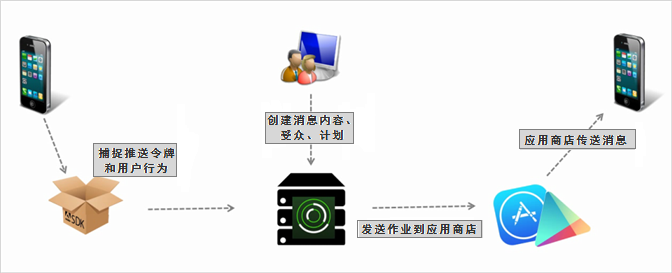

# 创建推送消息 {#create-a-push-message}

您可以通过 Mobile Services UI 将推送消息发送至 Analytics 区段，以便您在与用户接触过程中利用强大的 Analytics 数据。

>[!IMPORTANT]
>
>在创建推送消息之前，请参阅[启用推送消息的先决条件](/help/using/c-manage-app-settings/c-mob-confg-app/configure-push-messaging/prerequisites-push-messaging.md)。

当用户不主动使用您的应用程序时，选择接收通知的用户会显示推送消息。 这些通知会提醒用户有关新更新、优惠和提醒。 借助这些通知，您可以在一个简化的工作流中创建、测试、管理和报告推送消息。

推送消息由应用程序商店在服务器端发送，而不是从AdobeMobile Services发送：

创建推送消息：

1. Click ***your_app_name*** > **[!UICONTROL Messaging]** > **[!UICONTROL Manage Messages]** > **[!UICONTROL Create Message]** > **[!UICONTROL Create Push]**.
1. 配置受众选项。

   有关更多信息，请参阅[受众：为推送消息定义和配置受众区段](/help/using/in-app-messaging/t-create-push-message/c-audience-push-message.md)。
