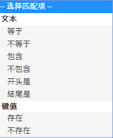

# 受众：应用程序内消息 {#audience-in-app-message}

您可以为应用程序内消息配置受众选项，包括查看、触发器和特征选项。

1. 在应用程序中，单击&#x200B;**[!UICONTROL 消息传送]** > **[!UICONTROL 管理消息]** > **[!UICONTROL 创建消息]** > **[!UICONTROL 创建应用程序内消息]**。
1. 在“受众”页面上的以下字段中键入相应信息：

   * **[!UICONTROL 查看]**

      选择触发消息显示的选项：

      * **[!UICONTROL 一直]**

         该选项表示每次触发都会显示消息。

      * **[!UICONTROL 一次]**

         该选项表示只有第一次触发才会显示消息。

      * **[!UICONTROL 点进之前]**

         该选项表示在用户点进之前，每次触发都会显示消息。此触发器仅适用于全屏消息和警告消息。大多数的消息需要重定向或使用 Internet 中的资源，且离线时不会显示。要始终显示消息而不考虑网络连接情况，请选中&#x200B;**[!UICONTROL 离线显示]**&#x200B;复选框。
   * **[!UICONTROL 触发器]**

      从下拉列表中选择一个选项，然后选择一个条件。例如，您可以从第一个下拉列表中选择&#x200B;**[!UICONTROL 已启动]**，从第二个下拉列表中选择&#x200B;**[!UICONTROL 存在]**。您还可以指定需要纳入显示消息的触发点击中的自定义上下文数据。

      >[!IMPORTANT]
      >
      >如果您选择多个触发器，则要显示消息，所有触发器都必须在同一个点击中发生。

   * **[!UICONTROL 特征]**
您可以确定在触发时应该看到应用程序内消息的人员，并过滤（划分）已指定数据的点击受众。例如，您可以定义一个规则，其中“目标点”包含“丹佛”。此过滤器允许您在触发规则时，向位于目标点丹佛的客户显示消息。

## 有关特征与触发器的其他信息 {#section_48C39EFB8CAA4F62B994FCC91DF588E6}

>[!IMPORTANT]
>
>触发器和特征使用的是从您的应用程序传递到 Analytics 的数据。这些值作为上下文数据、映射的变量和量度传入。变量是一个基于文本的值，而量度则是一个数值。

要在 Mobile Services UI 中查看这些键值对的映射，并验证触发器的值，请单击&#x200B;**[!UICONTROL 管理应用程序设置]** > **[!UICONTROL 管理变量与量度]**，接下来则会显示以下选项卡：

* **[!UICONTROL 标准变量和量度]**
* **[!UICONTROL 自定义变量]**
* **[!UICONTROL 自定义量度]**

验证映射后，请选择恰当的匹配项或逻辑运算符，以配置消息的受众。

### 选择量度和变量 {#example_AB126F03BD1C4094B791E230B3DB1189}

以下情形可帮助您确定是选择量度还是选择变量作为触发器：

### 量度

量度是数字，例如购买数量便是一个量度。

1. 单击&#x200B;**[!UICONTROL 管理消息]** > **[!UICONTROL 创建消息]**。
1. 在&#x200B;**[!UICONTROL 受众]**&#x200B;选项卡的&#x200B;**[!UICONTROL 触发器]**&#x200B;部分，完成以下步骤：

   1. 选择一个标准事件（例如&#x200B;**[!UICONTROL 已启动]**），然后选择&#x200B;**[!UICONTROL 存在]**。
   1. 再选择一个属于自定义数据点且已映射到量度的触发器。
   1. 在&#x200B;**[!UICONTROL 数字]**&#x200B;下方，选择一个匹配项。

### 变量

变量是用作唯一标识符的文本字符串，例如国家/地区、机场等都属于变量。

1. 单击&#x200B;**[!UICONTROL 管理消息]** > **[!UICONTROL 创建消息]**。
1. 在&#x200B;**[!UICONTROL 受众]**&#x200B;选项卡的&#x200B;**[!UICONTROL 触发器]**&#x200B;部分，完成以下步骤：

   1. 选择一个标准事件（例如&#x200B;**[!UICONTROL 已启动]**），然后选择&#x200B;**[!UICONTROL 存在]**。
   1. 再选择一个属于自定义数据点且已映射到变量的触发器。
   1. 在&#x200B;**[!UICONTROL 文本]**&#x200B;下方，选择一个匹配项。

有关上下文数据、变量和量度的更多信息，请参阅[管理您的应用程序](/help/using/manage-apps/manage-apps.md)。
