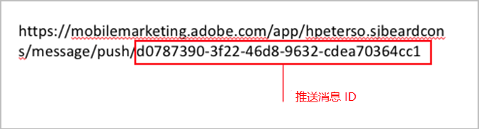
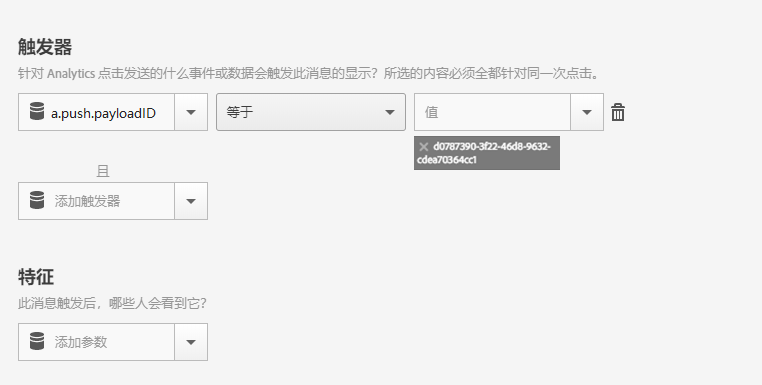

# 在从推送消息中打开应用程序时触发应用程序内消息{#trigger-an-in-app-message-when-the-app-is-opened-from-a-push-message}

您可以将应用程序内消息触发器设置为在用户从推送消息打开应用程序时发送的推送消息 ID。

1. 为将发送给用户的推送消息获取推送消息 ID。

   在消息创建工作流程中，您可以在URL中找到推送消息ID。

   示例如下：

   

1. 使用以下触发器保存并激活应用程序内消息：

   `“a.push.payloadID” =`

   >[!TIP]
   >
   >推送消息 ID 就是您在步骤 1 中找到的 ID。

   此触发器必须手动添加，因为它并未在&#x200B;**[!UICONTROL 触发器]**&#x200B;下拉列表中提供。

   

1. 保存并发送 ID 为您在步骤 1 中所找到推送 ID 的推送消息。
1. 点进推送消息以打开应用程序，验证在应用程序打开时是否显示应用程序内消息。

   测试时，请记住以下信息：

   * 保存应用程序内消息后，托管配置文件用新消息进行更新需要大约45秒。
   * 当有新启动项时，应用程序会查找配置文件更新( **新的应用程序内消息** )，因此您必须确保在单击推送消息时应用程序正在触发新启动项。

   这通常意味着您需要确保会话超时。 默认超时为5分钟。

