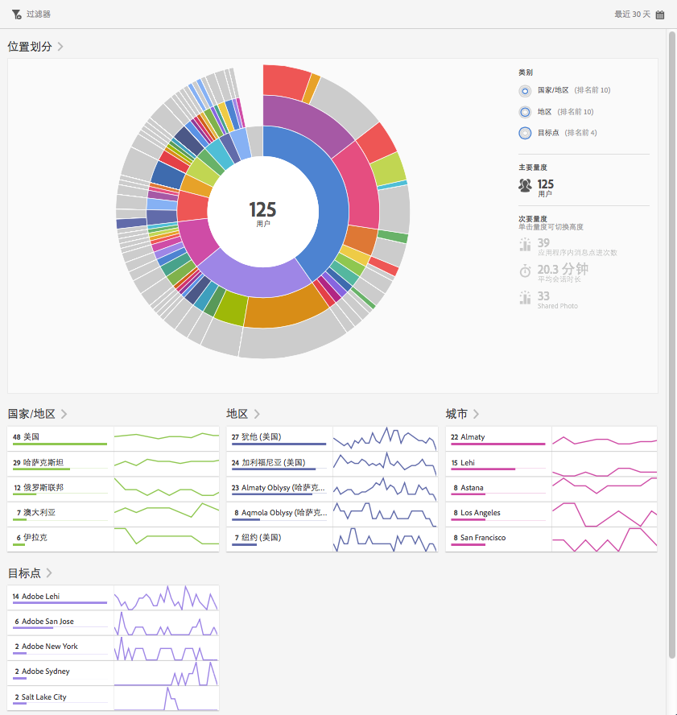
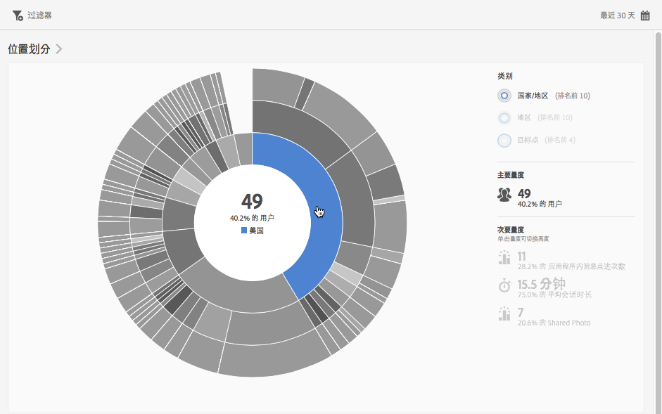
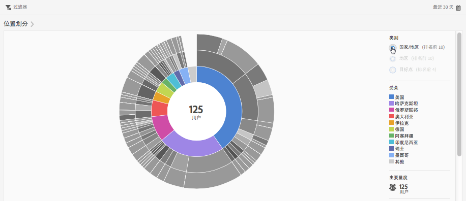
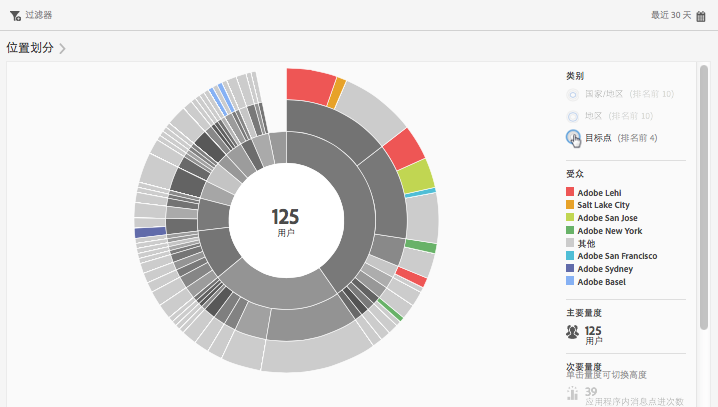
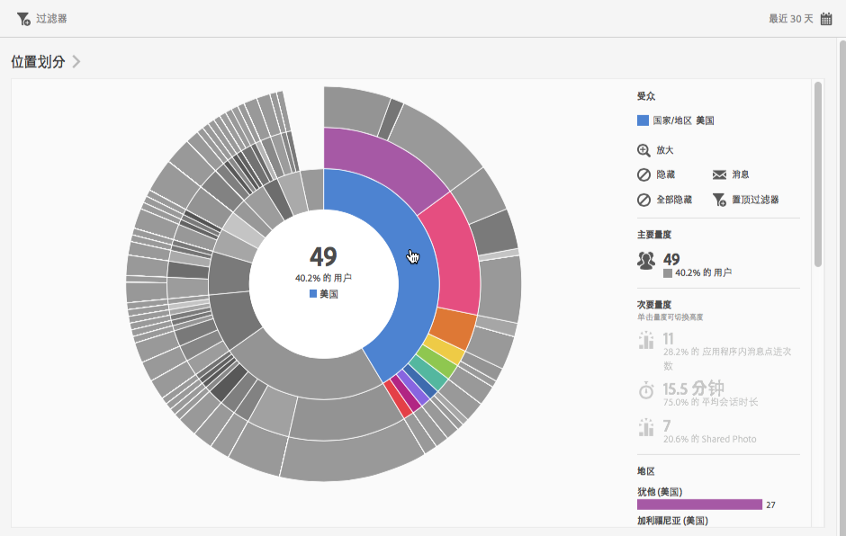
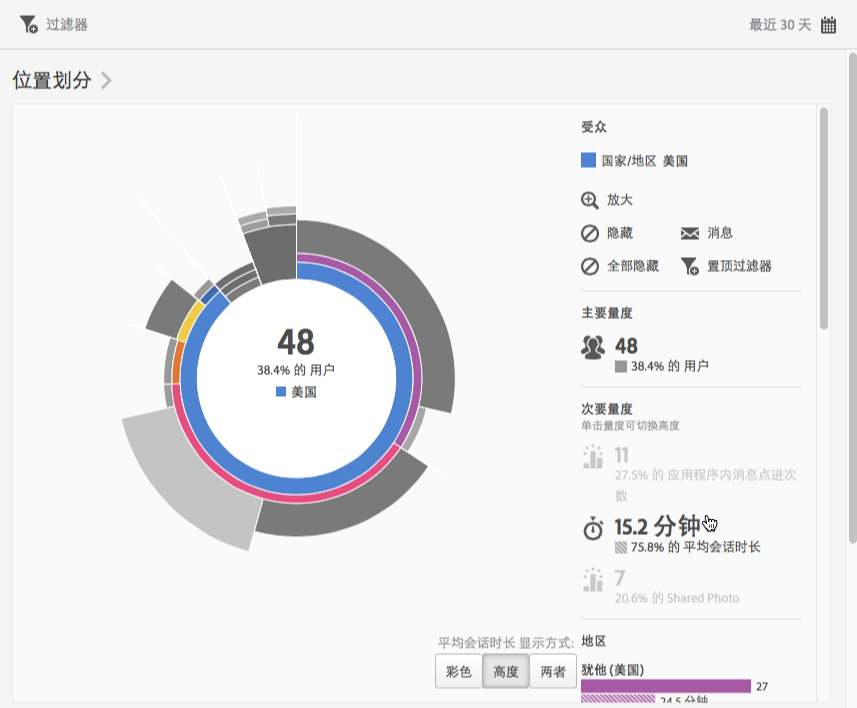
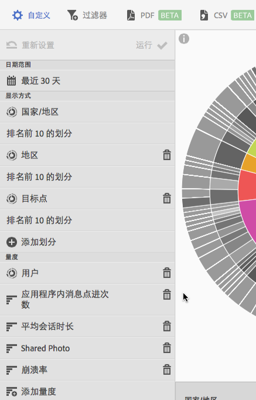

# 概述（位置）{#overview-location}

**[!UICONTROL 位置概述]**&#x200B;报表允许您查看正在使用您的应用程序的不同国家、地区和目标点 (POI)。

此报表可为您的现有数据提供一种环状层次图可视化，您可以使用此报表发现用于定位的受众区段（访客集合）。创建和管理受众与创建和使用区段类似，不同点在于您可以使受众在 Experience Cloud 中使用。

以下是有关此报表的一些其他信息：

## 导航和使用情况 {#section_4A88C3849B5847BF8CF433CCFD99FDC3}

例如，此可视化图表提供了基本报表以及划分等内容。可视化图表使用高度来显示受关注的量度，以及不同量度之间的性能差异。每个环代表该圆环类别中的受众区段。您可以对受众执行各种操作，例如应用置顶过滤器、隐藏量度，以及查看量度。

>[!TIP]
>
>除了此信息以外，您还可以查看产品中提供的描述如何与环状层次图交互的教程。要启动该教程，请单击报表标题栏中的&#x200B;**[!UICONTROL 位置划分]**，然后单击 **[!UICONTROL i]** 图标。

这是一个可交互式环状层次图。您可以单击右上角的&#x200B;**[!UICONTROL 日历]**&#x200B;图标来更改时间段。将鼠标悬停在图表的任何部分上可显示更多信息。例如，在下图中，您可以看到使用您的应用程序的美国用户总数和百分比。

在此插图中，通过右上角的&#x200B;**[!UICONTROL 类别]**&#x200B;按钮，您可以切换查看有关前十个国家和地区的信息和有关前三个&#x200B;**[!UICONTROL 目标点]**&#x200B;的信息。

当您选择&#x200B;**[!UICONTROL 国家/地区]**&#x200B;时，您可以看到以下视图：

当您选择&#x200B;**[!UICONTROL 目标点]**&#x200B;时，您可以看到以下视图：

您可以单击环中的一段以便选择受众并对其执行操作，例如放大、隐藏受众，创建应用程序内消息或置顶过滤器。

您可以单击右侧的次要量度将其添加到视图，并使用颜色、高度或两者来显示此量度。

## 添加划分和量度 {#section_15833511E82648869E7B1EFC24EF7B82}

您可以添加划分和次要量度，这会更改每个受众相对于图表中其他受众的高度。

>[!TIP]
>
>您在环状层次图中添加的环越多，所需的处理时间就越长。

要添加划分和次要量度，请单击报表标题栏中的&#x200B;**[!UICONTROL 位置划分]**，然后单击&#x200B;**[!UICONTROL 自定义]**&#x200B;打开右侧边栏。

单击&#x200B;**[!UICONTROL 添加划分]**&#x200B;或&#x200B;**[!UICONTROL 添加量度]**&#x200B;后，将显示一个新项目，其名称与相应列表中上一个项目的名称相同。单击新创建的划分或量度会显示一个下拉列表，您可以从中选择新项目。

## 创建置顶过滤器 {#section_365999D49FC744ECBF9273132497E06C}

单击环中的一段选择要创建置顶过滤器的受众，然后单击&#x200B;**[!UICONTROL 置顶过滤器]**。此置顶过滤器允许您应用当前过滤器，并根据过滤器运行新报表。

## 共享报表 {#section_F8AF2AA73D4C4C008976D45847F82D0B}

在您创建报表之后，系统会使用您的设置创建一个可供复制和共享的自定义 URL。

## 其他信息

有关位置的更多信息，请参阅以下内容：

* [地图](/help/using/location/c-map-points.md)
* [管理目标点](/help/using/location/t-manage-points.md)