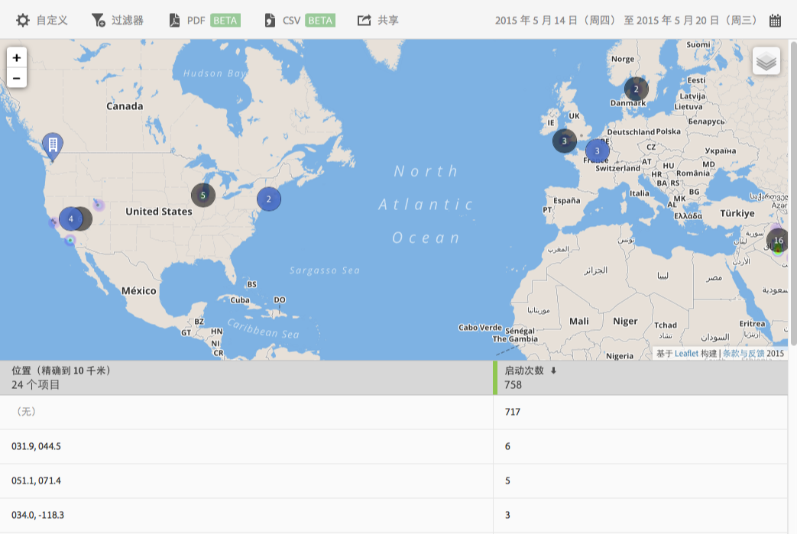

# 地图 {#map}

您可以查看交互式地图，它会显示您的 POI 和其他数据标记。

请牢记以下一些重要信息：

* 您可以放大或缩小地图尺寸。

   例如，当您有两个目标点且二者很接近时，此功能非常有用。放大地图可以查看更多详细信息。
* 您的目标点以蓝色显示。

   其他数据标记（例如，启动次数）以黑色显示。单击标记可查看更多信息。

单击  选择以下选项：

* **[!UICONTROL 地图]**

   显示一张简单的地图。

* **[!UICONTROL 卫星]**
以卫星模式显示地图。

* **[!UICONTROL 数据标记]**

   选择是否显示黑色的数据标记。

* **[!UICONTROL 热图]**

   选择是否显示热图标记。颜色强度越大，满足条件（例如，启动次数）的频率就越高。

* **[!UICONTROL 目标点]**

   选择是否显示您的目标点。

您可以为此报表配置以下选项：

* **[!UICONTROL 时间段]**

   单击&#x200B;**[!UICONTROL 日历]**&#x200B;图标可选择自定义时间段，或从下拉列表中选取预设时间段。

* **[!UICONTROL 自定义]**

   通过更改&#x200B;**[!UICONTROL 显示方式]**&#x200B;选项、添加量度和过滤器，以及添加其他系列（量度）等自定义您的报表。有关更多信息，请参阅[自定义报表](/help/using/usage/reports-customize/t-reports-customize.md)。

* **[!UICONTROL 过滤器]**

   单击&#x200B;**[!UICONTROL 过滤器]**&#x200B;可创建跨不同报表的过滤器，以便查看区段在所有移动设备报表中的执行情况。置顶过滤器允许您定义应用于所有非路径报表的过滤器。有关更多信息，请参阅[添加置顶过滤器](/help/using/usage/reports-customize/t-sticky-filter.md)。

* **[!UICONTROL 下载]**

   单击 **[!UICONTROL PDF]** 或 **[!UICONTROL CSV]** 可下载或打开文档，并与无法访问 Mobile Services 的用户共享，或者在演示文稿中使用该文件。