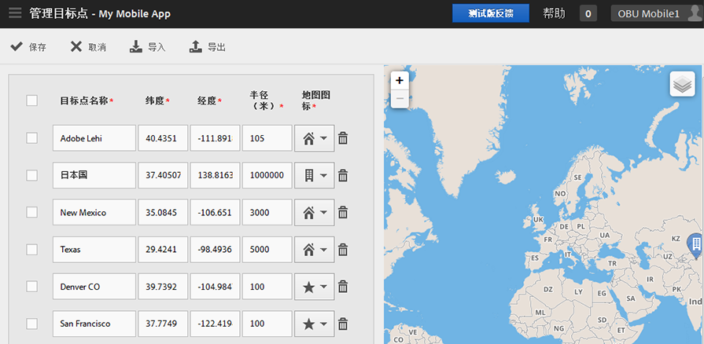

# Manage points of interest {#manage-points-of-interest}

You can create and manage POIs, which allow you to define geographical locations that you can use for correlation purposes, target with in-app messages, and so on. 在POI中发送点击时，POI将附加到该点击。

在使用“位置”之前，请验证以下要求：

* 您必须拥有 Analytics—Mobile 应用程序或 Analytics Premium。
* 您必须为应用程序启用&#x200B;**[!UICONTROL 位置报表]。**
* If you are using a version of the iOS SDK or Android SDK older than version 4.2, after adding new **[!UICONTROL Points of Interest]**, you must download a new configuration file and give it to your app developers.

   If you are using the iOS SDK or Android SDK version 4.2 or later, you do not need to submit an app update to the store to update your **[!UICONTROL Points of Interest]**. 在“管理目标点”页面上，单击“保 **[!UICONTROL 存]**”时，更改将打包到“目标点 **** ”列表，并更新实时应用程序的配置文件。 保存操作还会更新用户设备上应用程序中的点列表，只要应用程序使用更新的SDK和配置以及远程POI URL。

On the user's device, for a hit to be assigned to a **[!UICONTROL Points of Interest]**, location must be enabled for the app.

要使用位置，请完成以下任务：

1. 单击应用程序的名称，以转到其“管理应用程序设置”页面。
1. Click **[!UICONTROL Location]** &gt; **[!UICONTROL Manage Points of Interest]**.

   

1. 在以下每个字段中键入信息：

   * **[!UICONTROL 点名称]**

      键入&#x200B;**[!UICONTROL 目标点]名称。**

      它可以是某城市、国家或地区的名称。您还可以创建特定位置（例如体育场馆或企业）周围的&#x200B;**[!UICONTROL 目标点]。**

   * **[!UICONTROL 纬度]**

      Type the latitude of the **[!UICONTROL Point of Location]**. 您可以从其他来源查找此信息，如 Internet。

   * **[!UICONTROL 经度]**

      Type the longitude of the **[!UICONTROL Point of Location]**. 您可以从其他来源查找此信息，如 Internet。

   * **[!UICONTROL 半径（米）]**

      键入要包含的&#x200B;**[!UICONTROL 目标点]周围区域的半径（以米为单位）。**&#x200B;例如，如果为科罗拉多州的丹佛创建POI，则可指定足够大的半径以包括丹佛市和周边地区，但不包括科罗拉多斯普林斯。

   * **[!UICONTROL 地图图标]**

      选择将在“概述”和“映射”报 [表上显示](/help/using/location/c-location-overview.md)[的图标](/help/using/location/c-map-points.md) 。

1. 根据需要添加其他POI。

   我们建议您添加的POI不超过5,000个。 如果您添加的目标点超过 5000 个，您可以保存这些点，但是您将收到警告消息，提醒您最佳实践提出的要求是添加 5000 个以下的目标点。

1. 单击&#x200B;**[!UICONTROL 保存]**。

To delete one or more POIs, select the applicable check boxes, and click **[!UICONTROL Remove Selected]**.

Click **[!UICONTROL Import]** or **[!UICONTROL Export]** to work with the data by using a `.csv` file instead of using the Adobe Mobile user interface.
