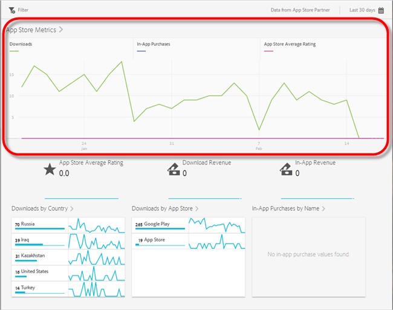
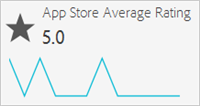
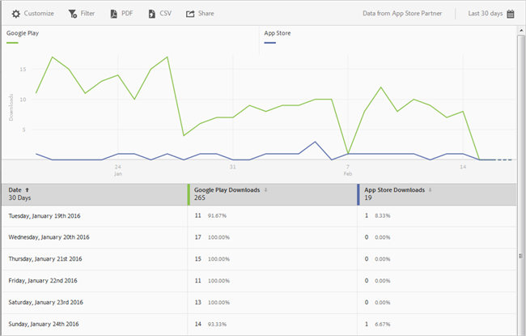
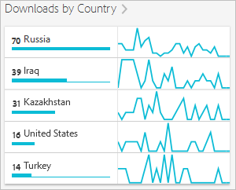
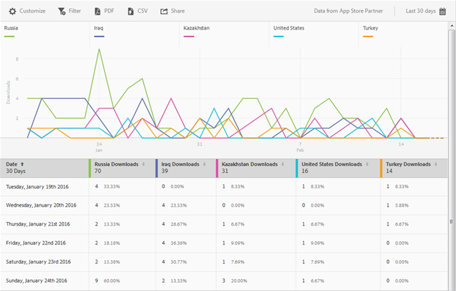
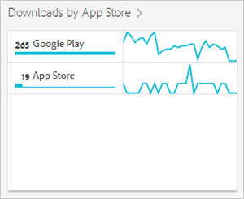

# App Store Overview report{#app-store-overview-report}

**[!UICONTROL 应用商店概述]报表会为您提供应用商店的量度信息，包括下载次数、应用程序内购买次数、应用商店平均评分、下载收入、应用程序内收入、按国家/地区划分的下载次数、按应用商店划分的下载次数，以及按名称划分的应用程序内购买次数。**

>[!TIP]
>
>In the Mobile Services UI, the **[!UICONTROL App Store]** menu item and **[!UICONTROL Overview]** report appear in the left navigation menu after you configure the integration.

**[!UICONTROL 概述]报表包含一个时间段内的图表，展示应用商店下载次数、使用您的应用程序进行的应用程序内购买次数，以及应用程序平均评分等相关信息。**

您可以单击任何量度来隐藏或显示其相应的行。要查看某一天的数据，请将鼠标悬停在当天上。

>[!IMPORTANT]
>
>App store metrics, such as downloads, rank, revenue, rating, and so on in Adobe Analytics require a Data Connector integration with an appropriate vendor. `appFigures` 目前提供了一个集成，您需要先从 `appFigures`**购买相应的产品和/或服务，之后**&#x200B;才能启用该集成。有关 Data Connector 集成的更多信息，请参阅 [Adobe Exchange](https://www.adobeexchange.com/experiencecloud.html)。

>[!TIP]
>
>In addition to changing the report's date range by clicking the calendar icon in the top right, you can customize some of the drill-down reports, add filters and series (metrics), add sticky filters, and download the report in PDF or CSV format. For more information, see [Customize reports](/help/using/usage/reports-customize/reports-customize.md).

## 应用商店平均评分 {#section_60D0D21824AE4450BC3E34D7ACA12A7A}

此报表可显示用户借助应用商店的功能针对您的应用程序给出的平均评分。

You can click anywhere on the **[!UICONTROL App Store Average Rating]** widget to display a graph and chart that displays the average rating by date. 要查看某一天的数据，请将鼠标悬停在当天上。

## 下载收入 {#section_34F05998E8444544A1B507C1B852C4EE}

此报表可显示通过下载您的应用程序所产生的收入金额。

## 应用程序内收入 {#section_58792ED9C4B54B7D836E30CF09E8E204}

此报表可显示使用您的应用程序进行应用程序内购买所产生的收入金额。

## 按国家/地区划分的下载次数 {#section_10373CD28CA94BA5859DFDEED7D548C6}

此报表可显示按国家/地区划分的应用程序下载次数。

To display a graph and chart that displays the number of downloads per country by date, click **[!UICONTROL Downloads by Country]**. 将鼠标悬停在某个日期上即可查看当天的数据。

## 按应用商店划分的下载次数 {#section_F1CD1A3F0105469D879E4F280CE32484}

此报表可显示按应用商店划分的应用程序下载次数。

To display a graph and chart that displays the number of downloads per app store grouped by date, click **[!UICONTROL Downloads by App Store]**. 将鼠标悬停在某个日期上即可查看当天的数据。

## 按名称划分的应用程序内购买次数 {#section_D747A64F9F6449E0A02EF31D56C92F83}

此报表可显示按名称划分的所有应用程序内购买次数。
