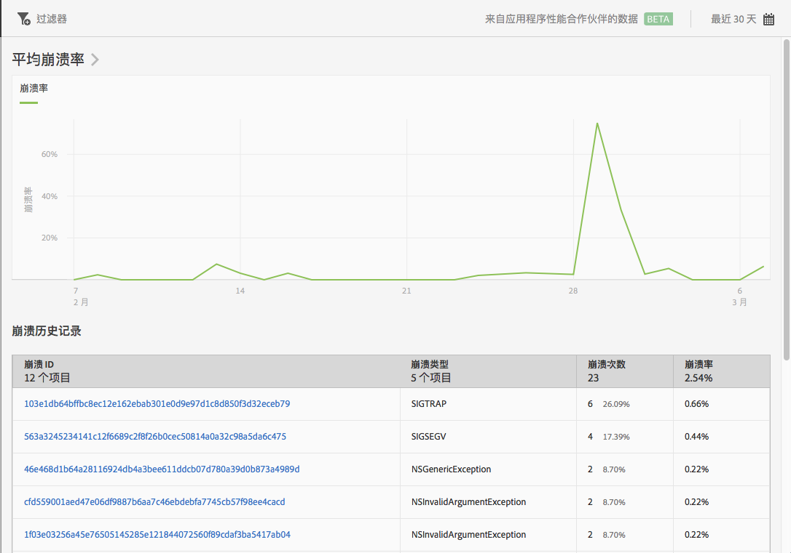

# 崩溃报告 {#crashes}

**[!UICONTROL 崩溃次数]报表可提供应用程序的崩溃信息。**&#x200B;您既可以查看崩溃次数和崩溃率，也可以登录 Apteligent 用户界面。

>[!IMPORTANT]
>
>To display the **[!UICONTROL Crashes]** report in the left navigation, you must first integrate your app with Apteligent.

**[!UICONTROL “平均崩溃速率”]** 图表显示按日期划分的崩溃速率。您可以将鼠标悬停在任意日期上查看当天的崩溃率。

**[!UICONTROL “崩溃历史记录]** ”图表显示了有关每个应用程序崩溃的信息，包括崩溃ID、崩溃类型、数字或崩溃以及崩溃日期。要登录 Apteligent 查看有关崩溃的更多详细信息，请单击&#x200B;**[!UICONTROL 崩溃 ID]列中的链接。**

您可以为此报表配置以下选项：

* **[!UICONTROL 时间段]**

   单击&#x200B;**[!UICONTROL 日历]图标可选择自定义时间段，或从下拉列表中选取预设时间段。**

* **[!UICONTROL 过滤器]**

   单击&#x200B;**[!UICONTROL 过滤器]可创建跨不同报表的过滤器，以便查看区段在所有移动设备报表中的执行情况。**&#x200B;置顶过滤器允许您定义应用于所有非路径报表的过滤器。

   有关更多信息，请参阅[添加粘性滤镜](/help/using/usage/reports-customize/t-sticky-filter.md)。