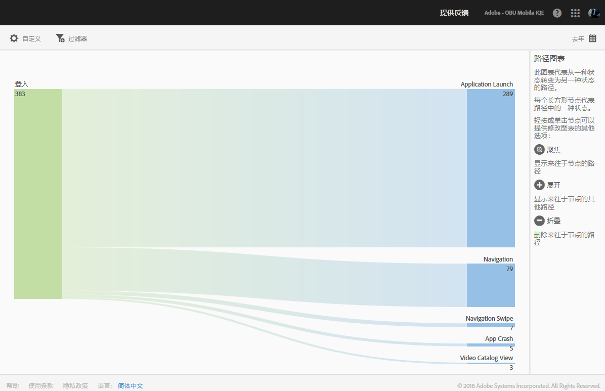
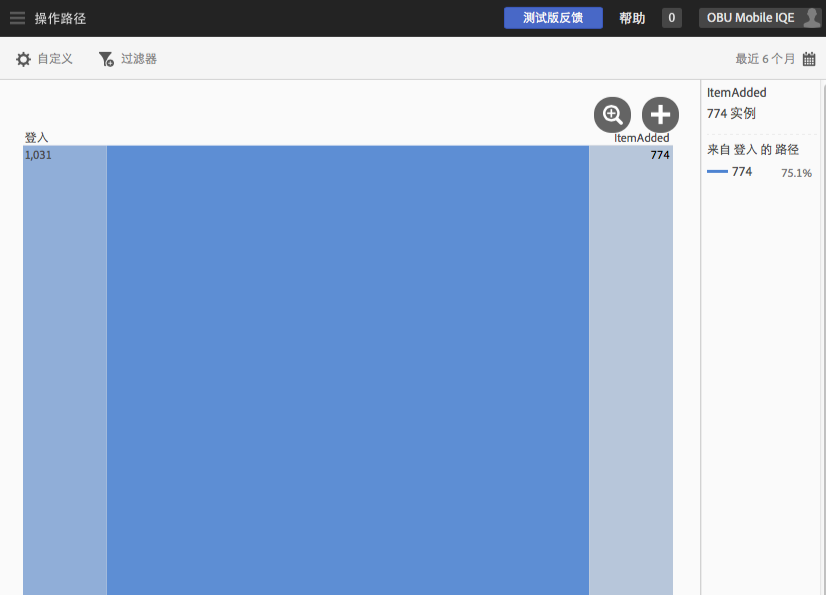
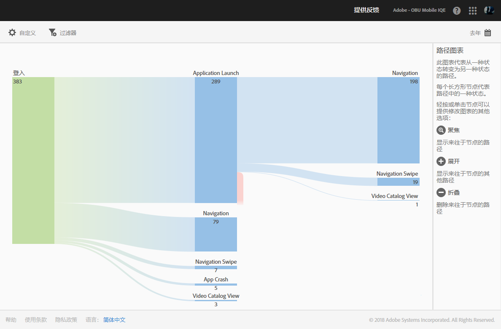
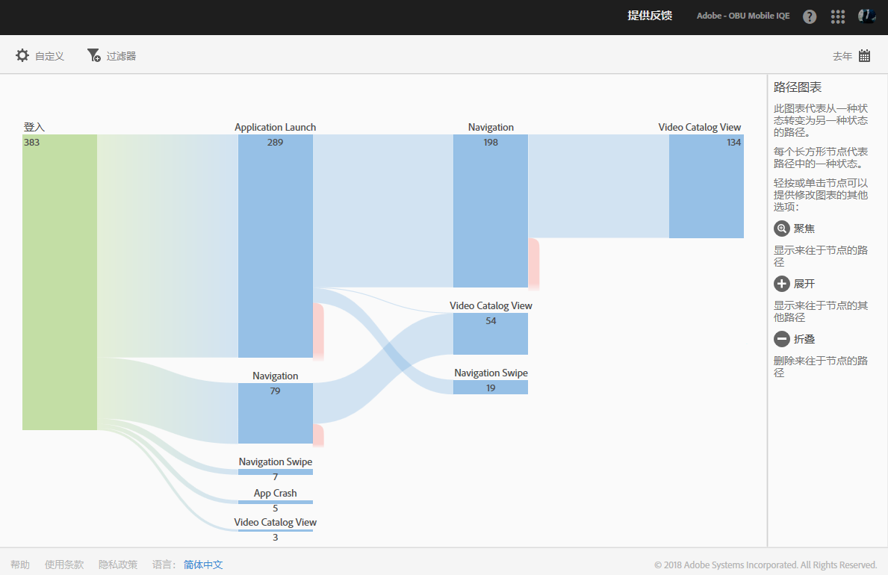

# 操作路径报告{#action-paths}

“操作路径”报表以路径分析为基础，可显示一个路径图表，以表示在应用程序中从一种状态变为另一种状态的路径。

**[!UICONTROL 查看路径]**&#x200B;报表和&#x200B;**操作路径[!UICONTROL 报表均属于路径报表。]****[!UICONTROL 查看路径]报表可向您展示用户在您的应用程序中如何从一个屏幕导航到下一屏幕。****[!UICONTROL 查看操作]报表可向您展示用户在您的应用程序中执行操作或事件（例如单击、选择、调整大小等等）的序列。**

>[!TIP]
>
>您可以使用漏斗报表将导航和操作合并到一个报告中。有关更多信息，请参阅 [漏斗](/help/using/usage/reports-funnel.md)。

每个形状类似于框的节点都表示用户路径通过应用程序时的一种状态。例如，在上图中，顶级节点表示启动应用程序然后从图库中选择照片的用户数量。

To display the options to modify the chart, click a node and click **[!UICONTROL Focus]** or **[!UICONTROL Expand]**. 例如，如果您单击顶级节点中的 **[!UICONTROL PhotoPicked]** 状态，即会显示&#x200B;**[!UICONTROL 集中]和**&#x200B;展开]图标。**[!UICONTROL **

To expand, click the **[!UICONTROL +]** icon. 此选项会显示进入节点或退出节点的其他路径。在下图中，状态 1 表示启动应用程序，状态 2 表示选取照片（您之前展开的项目），而状态 3 包含用户采取的不同路径：

* 选择项目
* 添加项目
* 拖动项目
* 缩放项目

展开状态类似于展开漏斗。

To isolate the node and show paths that come into, and go out of the selected node, click the   icon. 在下图中，用户选择照片&#x200B;**之前**&#x200B;完成了以下路径：

* 旋转项目
* 缩放项目
* 拖动项目
* 删除项目

对于已选择照片的用户，在选择照片&#x200B;**之后**&#x200B;完成了以下路径：

* 选择项目
* 添加项目
* 拖动项目
* 缩放项目

您可以集中或展开多个节点，以详细了解用户在您的应用程序内所采用的路径。例如：

您可以为此报表配置以下选项：

* **[!UICONTROL 时间段]**

   单击&#x200B;**[!UICONTROL 日历]图标可选择自定义时间段，或从下拉列表中选取预设时间段。**

* **[!UICONTROL 自定义]**

   通过更改&#x200B;**[!UICONTROL 显示方式]选项、添加量度和过滤器，以及添加其他系列（量度）等自定义您的报表.** For more information, see [Customize reports](/help/using/usage/reports-customize/reports-customize.md).

* **[!UICONTROL 过滤器]**

   单击&#x200B;**[!UICONTROL 过滤器]可创建跨不同报表的过滤器，以便查看区段在所有移动设备报表中的执行情况。**&#x200B;置顶过滤器允许您定义应用于所有非路径报表的过滤器。有关更多信息，请参阅 [添加粘性滤镜](/help/using/usage/reports-customize/t-sticky-filter.md)。

* **[!UICONTROL 下载]**

   Click **[!UICONTROL PDF]** or **[!UICONTROL CSV]** to download or open documents and share with users who do not have access to Mobile Services or to use the file in presentations.