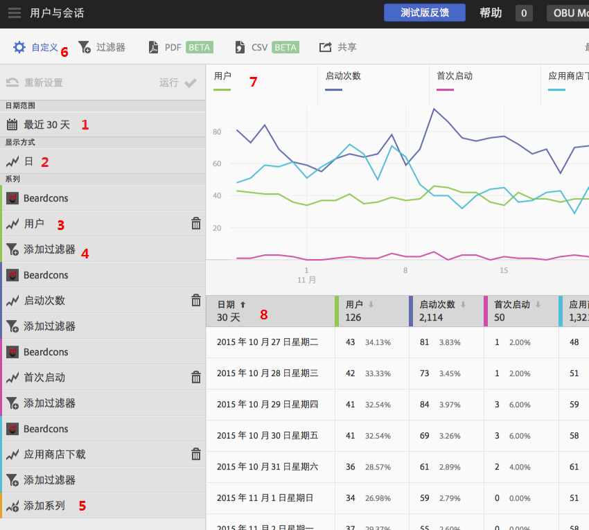

# 自定义报表{#customize-reports}

此信息可帮助您了解和自定义内置报表。

您可以通过更改日期范围、更改&#x200B;**[!UICONTROL 显示方式]**&#x200B;选项（按时间段或按维度显示图形和表格数据）、添加量度和过滤器、添加其他系列（量度）等方式，自定义您的报表。

要显示“自定义”边栏，请单击应用程序名称以转到其“概述”页面，然后单击&#x200B;**[!UICONTROL 自定义]**。

以下示例显示打开了&#x200B;**[!UICONTROL 自定义]**&#x200B;边栏的“用户和会话”报表。此示例以天为单位显示最近 30 天的数据，其中包含四个有效系列：

* **[!UICONTROL 用户]**
* **[!UICONTROL 启动次数]**
* **[!UICONTROL 首次启动次数]**
* **[!UICONTROL 应用商店下载次数]**

以下信息描述了报表和&#x200B;**[!UICONTROL 自定义]**&#x200B;边栏的每个区域：

| 数值 | 描述 |
|--- |--- |
| 1 | 在&#x200B;**[!UICONTROL 日期范围]**&#x200B;中，您可以通过下拉列表为报表选择各种不同的日期范围。图表 (9) 和相应的表 (10) 中的所有数据均符合所选日期范围。 |
| 2 | 在&#x200B;**[!UICONTROL 显示方式]**&#x200B;中，您可以通过下拉列表为报表选择基于时间或基于维度的显示方式。例如，在上面的插图中，您可以看到选择的是天。如果您查看一下图表 (7) 下面的日期和表格 (8) 中的行，会发现数据是按特定时段报表中的日期分类的。通过向报表中添加其他系列，可在特定时段报表中报告最多六个量度。如果您选择“生命周期”维度，则可以查看排名列表中排名前 50 个值、按天或周划分的排名前 5 的趋势值或排名前 5 或 10 个值细分。 |
| 3 | **[!UICONTROL 系列]**&#x200B;表示单个量度，例如上面示例中的用户数、启动次数、首次启动次数和应用商店下载次数。每个系列均采用颜色编码，并具有图表 (7) 和表格 (8) 中的数据。您可以添加其他系列（量度），甚至添加其他报表包中的不同应用程序，以比较数据。有关更多信息，请参阅[将系列（量度）添加到报表](/help/using/usage/reports-customize/t-reports-series.md)。 |
| 4 | 借助&#x200B;**[!UICONTROL 添加过滤器]**，您可以通过添加其他过滤器（区段）来自定义内置报表。有关更多信息，请参阅[将过滤器添加到报表](/help/using/usage/reports-customize/t-reports-customize.md)。 |
| 5 | 借助&#x200B;**[!UICONTROL 添加系列]**，您可以通过添加其他系列（量度）或不同报表包内的应用程序来比较数据，从而自定义内置报表。有关更多信息，请参阅[将系列（量度）添加到报表](/help/using/usage/reports-customize/t-reports-series.md)。 |
| 6 | 通过&#x200B;**[!UICONTROL 置顶过滤器]**，您可以创建跨不同报表的过滤器。例如，您可能希望了解某个特定区段是如何跨所有移动报表执行的。置顶过滤器可让您定义应用于所有非路径报表的过滤器。有关更多信息，请参阅[添加置顶过滤器](/help/using/usage/reports-customize/t-sticky-filter.md)。 |
| 7 | **[!UICONTROL 数据图表]**&#x200B;在一个基于选定量度的相应图表中显示数据。图表类型包括折线图、条形图、圆环图等。 |
| 8 | **[!UICONTROL 数据表格]**&#x200B;以表格形式显示数据。您可以单击某个列标题，以对数据进行升序或降序排序。 |

