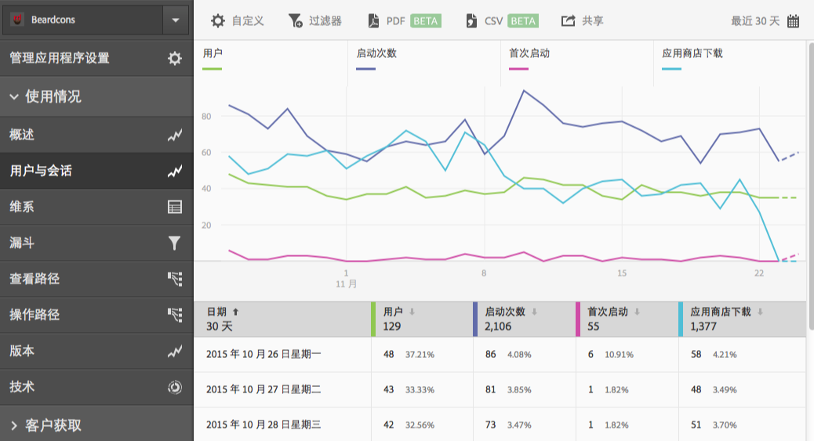
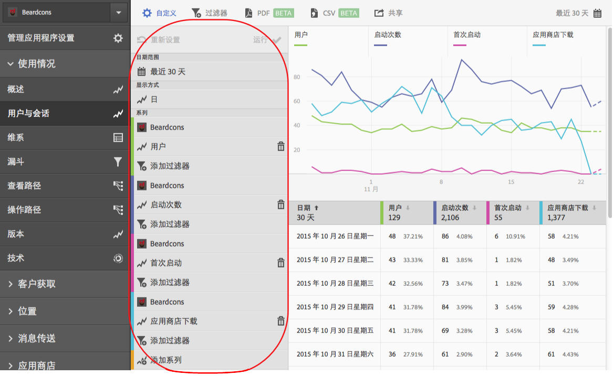
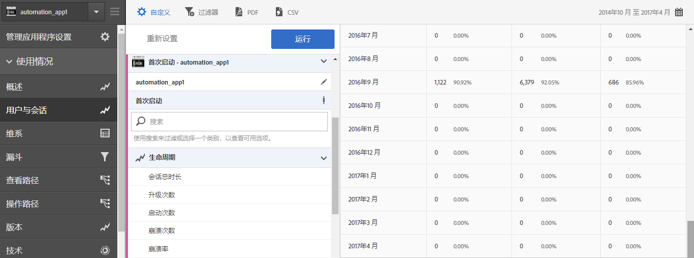
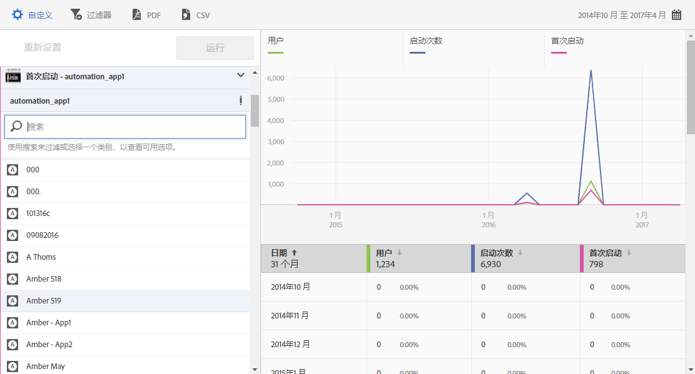

# 将系列（量度）添加到报表{#add-series-metrics-to-reports}

此信息可帮助您通过添加其他系列（量度）或不同报表包内的应用程序来比较数据，从而帮助您自定义内置报表。

>[!IMPORTANT]
>
>Marketing Reports &amp; Analytics、Ad Hoc Analysis、Data Warehouse 和其他 Analytics 报表界面中也提供了移动设备应用程序量度。如果某个划分或报表类型在 Adobe Mobile 中不可用，则它可能是使用其他报表界面生成的。

在本示例中，我们将自定义&#x200B;**[!UICONTROL 用户和会话]**&#x200B;报表，但相关说明适用于任何报表。

1. 打开您的应用程序，然后单击&#x200B;**[!UICONTROL 使用情况]** > **[!UICONTROL 用户和会话]**。

   

   此报表可提供关于应用程序用户的完整历时视图。但是，我们希望添加一个系列来报告应用程序崩溃情况。

1. 单击&#x200B;**[!UICONTROL 自定义]**。

   

1. 向下滚动，然后单击&#x200B;**[!UICONTROL 添加系列]**。

   使用列表中最后一个系列的名称填写系列的名称。在上面的插图中，最新的系列是&#x200B;**[!UICONTROL 应用商店下载次数]**，由此可见添加了一个同样名为&#x200B;**[!UICONTROL 应用商店下载次数]**&#x200B;的新系列。

1. 完成以下任务之一：

   * 要添加新系列（量度），请单击您新创建的系列的名称，然后从下拉列表中选择一个新的生命周期量度。

      

   * 要在其他报表包中添加新应用程序以便比较应用程序之间的数据，请单击新创建系列中的应用程序名称，然后选择所需的应用程序。

      

1. （有条件）将过滤器添加到新系列。

   有关更多信息，请参阅[将过滤器添加到报表](/help/using/usage/reports-customize/t-reports-customize.md)。
1. 单击&#x200B;**[!UICONTROL 更新]**，然后单击&#x200B;**[!UICONTROL 运行]**。
