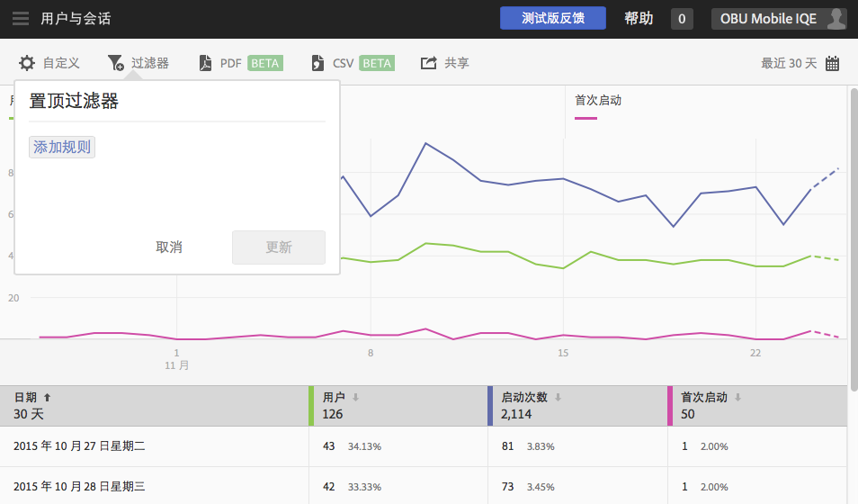
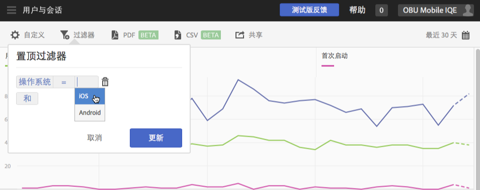
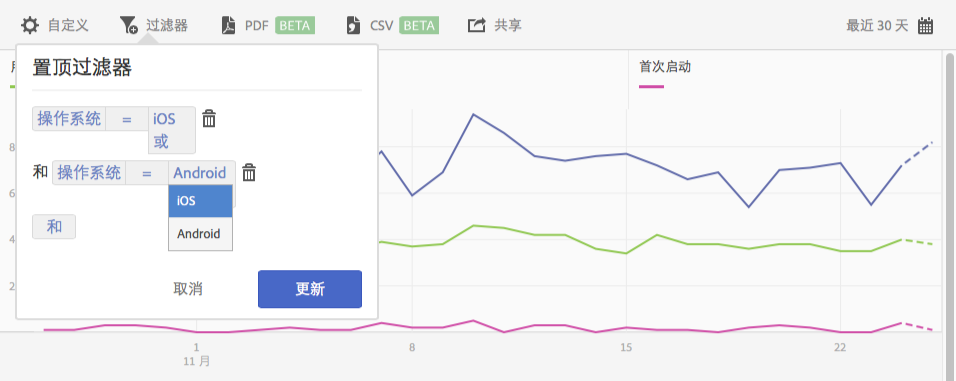

# Add a sticky filter{#add-sticky-filter}

创建跨不同报表的过滤器，以便查看特定区段在所有移动设备报表中的执行情况。置顶过滤器可让您定义应用于所有非路径报表的过滤器。

以下示例将适用于 iOS 和 Android 操作系统的置顶过滤器添加到&#x200B;**[!UICONTROL 用户和会话]报表，但相关说明也适用于任何报表或量度。**

1. 单击Adobe **[!UICONTROL Mobile中任何报表顶部的]** “过滤器”图标。

   

1. 在“粘性过滤器”对话框中，单 **[!UICONTROL 击“添加规则]**”，选择“操 **[!UICONTROL 作系统]**”，然后从下拉列表中选择“ **[!UICONTROL iOS]**”。

   要将Android添加为过滤器，请重复此步骤。

   

1. Click **[!UICONTROL And]**, select **[!UICONTROL Operating Systems]**, and from the drop-down list, select **[!UICONTROL Android]**.

   您的过滤器现在应当类似于以下示例：

   

1. Click **[!UICONTROL Update]** and **[!UICONTROL Run]**.
