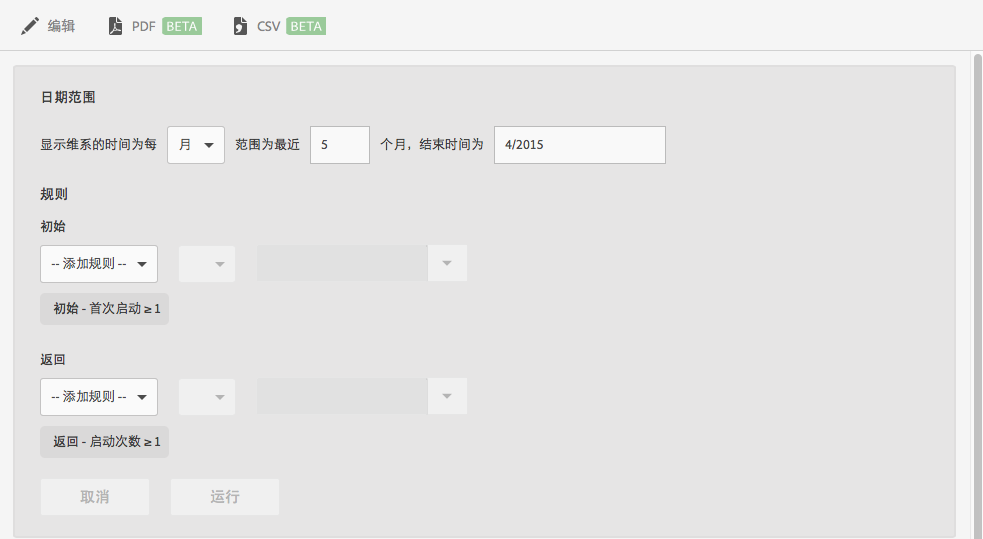

# “维系”报表{#retention}

**[!UICONTROL 维系]**&#x200B;报表（前称“首次启动同期群”）是一种同期群报表，可显示有多少位独特用户在首次启动您的应用程序后，又在随后几个月里至少再次启动了一次。

默认情况下，此报表会根据用户首次启动应用程序的时间来显示用户组的维系情况。您还可以自定义此报表，以便使用“首次启动”之外的量度和添加其他操作。

同类群组是指在定义的时间段内具有共同特征或体验的一群人员。**[!UICONTROL 维系]**&#x200B;报表会利用在特定时间（天、周或月）安装该应用程序的用户的共同特点，并绘制图表以显示其中有多少用户在接下来的 X 天、周或月中启动了该应用程序。此报表会显示访客保持活跃或参与的维系情况。

以下是此报表的示例：

在 **[!UICONTROL MO]** 列中，显示在 2014 年 11 月首次启动应用程序的总人数。在 **[!UICONTROL M1]** 列中，显示在 2014 年 12 月（以此类推）又再次启动该应用程序的人数。

要更改日期范围或编辑报表规则，请单击&#x200B;**[!UICONTROL 编辑]**。

报表可由任何变量或量度填充，例如生命周期量度（但不包括计算量度）。
