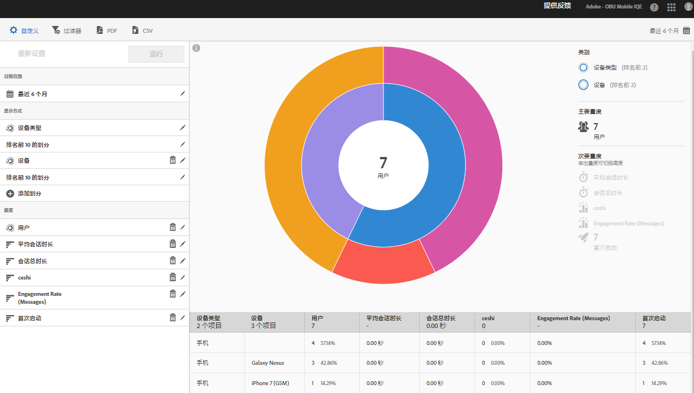

# “技术”报表 {#technology}

**[!UICONTROL 技术]**&#x200B;报表允许您查看正在使用您的应用程序的不同设备类型、操作系统、操作系统版本和移动运营商。

此报表可为您的现有数据提供一种环状层次图可视化，您可以使用此报表发现用于定位的受众区段（访客集合）。创建和管理受众与创建和使用区段类似，不同点在于您可以使受众在 Experience Cloud 中使用。

## 导航和使用情况 {#section_83CA60E1AE6245FEBCBFF3205615C4DF}

例如，此可视化提供了基本报表和细分，使用高度来显示焦点中的度量以及度量之间的性能差异。 每个环代表环的类别中的受众段。 您可以对受众执行操作，如应用粘滞过滤器、隐藏度量和查看度量。

>[!TIP]
>
>除了此信息以外，您还可以查看产品中提供的描述如何与环状层次图交互的教程。要启动此教程，请单击报表标题栏中的&#x200B;**[!UICONTROL 技术划分]**，然后依次单击&#x200B;**[!UICONTROL 自定义]**&#x200B;和 **[!UICONTROL i]** 图标。

日爆图是交互式的，您可以完成以下任务:

* 将鼠标悬停在图表的任何部分上可显示更多信息。
* 单击&#x200B;**[!UICONTROL 日历]**&#x200B;图标更改时间段。
* 单击环中的一段可选择受众并对其执行操作，例如放大，隐藏受众，创建应用程序内消息或置顶过滤器。
* 选择右上角的&#x200B;**[!UICONTROL 设备类型]**&#x200B;和&#x200B;**[!UICONTROL 设备]**&#x200B;查看有关设备和设备类型的信息。

* 单击右侧的辅助度量，将其添加到可视化。

   您可以通过颜色和/或高度来显示次要量度。

下表介绍了标准报表以及它们是如何在 Mobile Services 中填充的：

| 报表 | 种群方法 | 描述 |
|--- |--- |--- |
| 设备 | 生命周期量度 | 按设备类型划分的常见指标。 |
| 操作系统 | 自动 | 按操作系统划分的常见指标。 |
| 操作系统版本 | 生命周期量度 | 按操作系统版本划分的常见指标。 |
| 运营商 | 自动 | 运营商划分的常见指标。 |

>[!TIP]
>
>在&#x200B;**[!UICONTROL 运营商]**&#x200B;报表中，Wi-Fi 用户报告为 `none`。

## 添加划分和量度 {#section_15833511E82648869E7B1EFC24EF7B82}

您可以添加划分和次要量度，这会更改每个受众相对于图表中其他受众的高度。

>[!IMPORTANT]
>
>您在环状层次图中添加的环越多，所需的处理时间就越长。

要添加划分和次要量度，请单击报表标题栏中的&#x200B;**[!UICONTROL 技术划分]**，然后单击&#x200B;**[!UICONTROL 自定义]**。

单击&#x200B;**[!UICONTROL 添加划分]**&#x200B;或&#x200B;**[!UICONTROL 添加量度]**&#x200B;后，将显示一个新项目，其名称与列表中上一个项目的名称相同。单击新创建的划分或量度会显示一个下拉列表，您可以从中选择新项目。

## 创建置顶过滤器 {#section_B4E355CD1FE34E4C8ADC38139ED67FC8}

单击环中的一段选择要创建置顶过滤器的受众，然后单击&#x200B;**[!UICONTROL 置顶过滤器]**。此过滤器允许您应用当前过滤器并根据过滤器运行新报告。

## 共享报告 {#section_560DD5CED5144249B7E49461E2422100}

在您创建报表之后，系统会使用您的设置创建一个可供复制和共享的自定义 URL。
