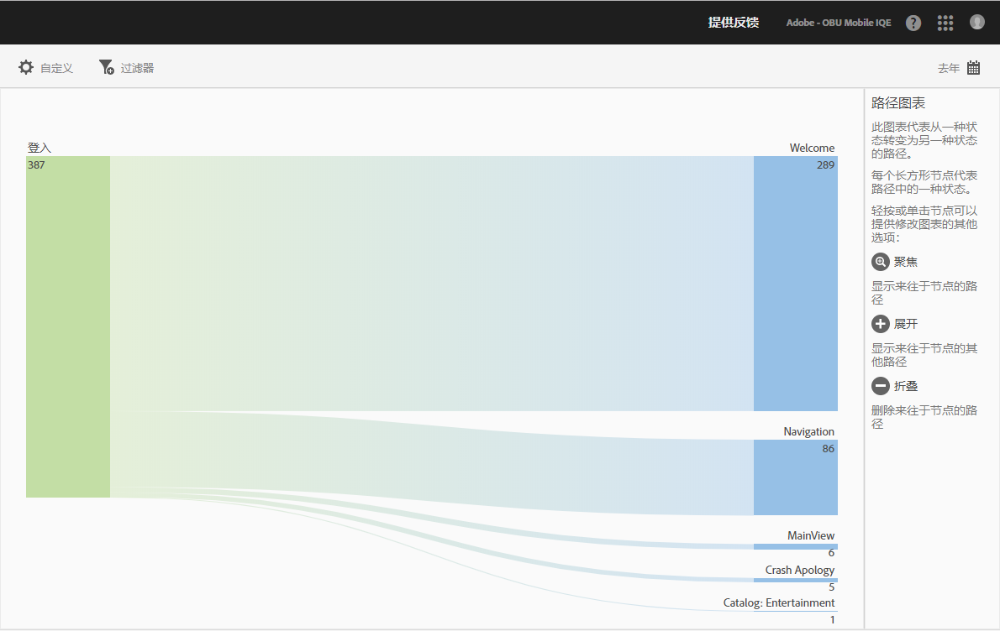
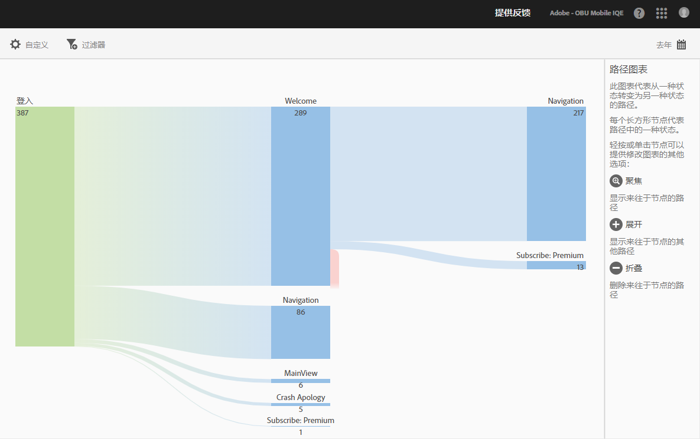
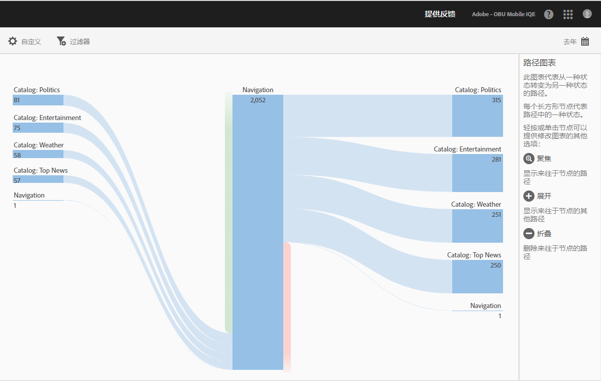
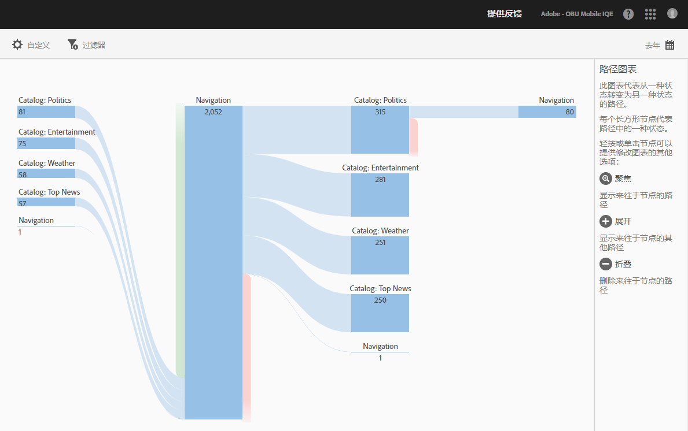

# “查看路径”报表 {#view-paths}

{#eol}

**[!UICONTROL 查看路径]**&#x200B;报表以路径分析为基础，可显示一个路径图表，以表示应用程序中不同状态之间的路径。

>[!TIP]
>
>**[!UICONTROL 查看路径]**&#x200B;报表与&#x200B;**[!UICONTROL 查看操作]**&#x200B;报表相似，因为两者都是路径报表。**[!UICONTROL 查看路径]**&#x200B;报表允许您查看用户在您的应用程序中如何从一个屏幕导航到下一屏幕。**[!UICONTROL 查看操作]**&#x200B;报表可显示用户在您的应用程序中执行操作或事件（例如单击、选择、调整大小等等）的序列。您可以使用“漏斗”报表将导航和操作组合到一个报表中。有关更多信息，请参阅[漏斗](/help/using/usage/reports-funnel.md)。

每个形状类似于框的节点都表示用户路径通过应用程序时的一种状态。例如，在上图中，顶级节点表示启动应用程序并导航到主视图的用户数量。

在单击某个节点以提供更多用于修改图表的选项后，即会显示诸如&#x200B;**[!UICONTROL 集中]**&#x200B;或&#x200B;****&#x200B;展开等更多选项。例如，在您单击顶级节点中的 **[!UICONTROL MainView]** 状态之后，即会显示&#x200B;**[!UICONTROL 集中]**&#x200B;和&#x200B;**[!UICONTROL 展开]**&#x200B;图标。

要展开视图，请单击 **[!UICONTROL +]** 图标以显示进入或退出节点的更多路径。在下图中，状态 1 表示启动应用程序，状态 2 表示查看应用程序的主页，状态 3 包含用户采用的不同路径：

* 导航到相机胶卷
* 导航到项目选择器
* 导航到相机
* 导航到项目信息页面

单击  可隔离选定节点，从而仅显示进入或退出该节点的路径。在下图中，以下路径位于查看应用程序主视图的用户之前：

* 项目信息
* 项目选择器
* 相机胶卷
* 相机

您可以集中或展开多个节点，以详细查看用户在您的应用程序中所采用的路径。例如：

您可以为此报表配置以下选项：

* **[!UICONTROL 时间段]**
单击**[!UICONTROL 日历]**&#x200B;图标可选择自定义时间段，或从下拉列表中选取预设时间段。
* **[!UICONTROL 自定义]**
通过更改**[!UICONTROL 显示方式]**&#x200B;选项、添加量度和过滤器，以及添加其他系列（量度）等自定义您的报表。有关更多信息，请参阅[自定义报表](/help/using/usage/reports-customize/reports-customize.md)。
* **[!UICONTROL 过滤器]**
单击**[!UICONTROL 过滤器]**&#x200B;可创建跨不同报表的过滤器，以便查看特定区段在所有移动设备报表中的执行情况。置顶过滤器允许您定义应用于所有非路径报表的过滤器。有关更多信息，请参阅[添加置顶过滤器](/help/using/usage/reports-customize/t-sticky-filter.md)。
* **[!UICONTROL 下载]**
单击 **[!UICONTROL PDF]** 或 **[!UICONTROL CSV]** 可下载或打开文档，并与无法访问 Mobile Services 的用户共享，或者在演示文稿中使用该文件。
