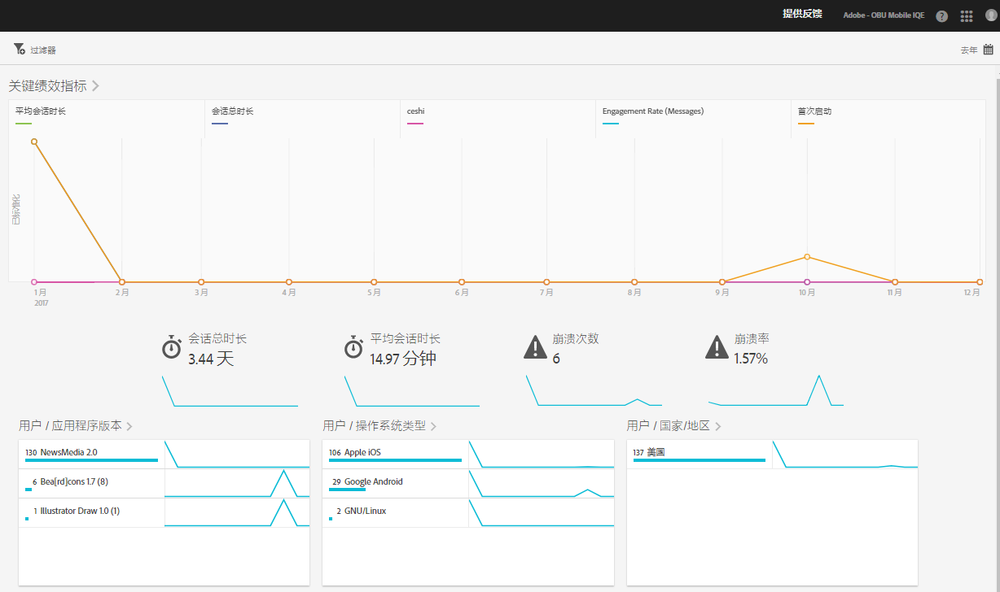

# “概述”报表{#overview}

“概述”报表可为您提供关键量度的基本信息。

以下是此报表的示例：

您可以通过单击右上方的日历图标来更改报表的日期范围。您还可以创建一个跨不同报表的置顶过滤器，以便查看区段在所有移动设备报表中的执行情况。有关创建置顶过滤器的更多信息，请参阅[添加置顶过滤器](/help/using/usage/reports-customize/t-sticky-filter.md)。

>[!TIP]
>
>您可以在创建应用程序时配置此报表的关键量度。有关更多信息，请参阅[配置您的应用程序](/help/using/c-manage-app-settings/c-mob-confg-app/c-mob-confg-app.md)。
