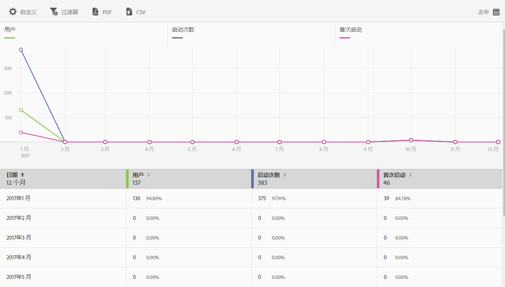

# Users and sessions report{#users-and-sessions}

“用户和会话”报表可显示独特访客在选定时间段的量度。

您可以为此报表配置以下选项：

* **[!UICONTROL 时间段]**

   单击&#x200B;**[!UICONTROL 日历]图标可选择自定义时间段，或从下拉列表中选取预设时间段。**

* **[!UICONTROL 自定义]**

   通过更改&#x200B;**[!UICONTROL 显示方式]选项、添加量度和过滤器，以及添加其他系列（量度）等自定义您的报表.** For more information, see [Customize Reports](/help/using/usage/reports-customize/t-reports-customize.md).

* **[!UICONTROL 过滤器]**

   单击&#x200B;**[!UICONTROL 过滤器]可创建跨不同报表的过滤器，以便查看区段在所有移动设备报表中的执行情况。**&#x200B;置顶过滤器允许您定义应用于所有非路径报表的过滤器。For more information, see Add sticky filter.

* **[!UICONTROL 下载]**

   Click **[!UICONTROL PDF]** or **[!UICONTROL CSV]** to download or open documents and share with users who do not have access to Mobile Services or to use the file in presentations.