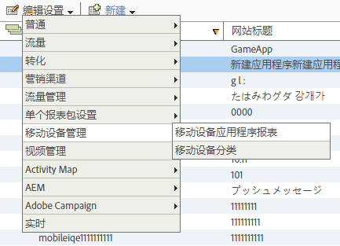

# Analytics {#analytics}

将库添加到项目后，您可以在应用程序中的任意位置进行任何Analytics方法调用。

>[!TIP]
>
>确保将`ADBMobile.h`导入类。

## 在Analytics中启用移动设备应用程序报表 {#section_F2F9234009184F20BA36B5CDE872B424}

在添加代码之前，请让Analytics管理员完成以下操作以启用移动设备应用程序生命周期跟踪。 这可确保在您开始开发时，您的报表包已准备好捕获量度。

1. 打开&#x200B;**[!UICONTROL 管理工具]** > **[!UICONTROL 报表包]**，然后选择您的移动设备报表包。
1. 单击&#x200B;**[!UICONTROL 编辑设置]** > **[!UICONTROL 移动设备管理]** > **[!UICONTROL 移动设备应用程序报表]**。

   

1. 单击&#x200B;**[!UICONTROL 启用最新的应用程序报表]**。

   或者，您也可以选择单击&#x200B;**[!UICONTROL 启用移动位置跟踪]**&#x200B;和&#x200B;**[!UICONTROL 启用后台点击量的旧版报告和归因]**。

   

生命周期量度现已准备就绪，可以捕获，移动设备应用程序报表显示在市场营销报告界面的&#x200B;**[!UICONTROL 报表]**&#x200B;菜单中。

### 新版本

移动应用程序报表的新版本会定期发布。 新版本不会自动应用于您的报表包，您必须重复这些步骤才能执行升级。 每次在应用程序中添加新Experience Cloud功能时，我们建议您重复这些步骤以确保您具有最新配置。

## 生命周期量度 {#section_532702562A7A43809407C9A2CBA80E1E}

要在应用程序中收集生命周期量度，请在激活应用程序时向添加调用，如以下示例中所示。

### 默认.js中的WinJS

```js
app.onactivated = function (args) { 
  if (args.detail.kind === activation.ActivationKind.launch) { 
   ... 
   // launched and resumed stuff  
   ADBMobile.Config.collectLifecycleData(); 
  } 
}; 
app.oncheckpoint = function (args) { 
  ADBMobile.Config.pauseCollectingLifecycleData(); 
}
```

### App.xaml.cs中的C#

```csharp
public App() 
{ 
    this.InitializeComponent(); 
    this.Resuming *= OnResuming; 
    this.Suspending *= OnSuspending; 
} 
protected override void OnLaunched(LaunchActivatedEventArgs e) 
{ 
    ... 
    ADBMobile.Config.CollectLifecycleData(); 
    ... 
} 
private void OnResuming(object sender, object e) 
{ 
    ... 
    ADBMobile.Config.CollectLifecycleData(); 
    ... 
} 
private void OnSuspending(object sender, SuspendingEventArgs e) 
{ 
    ... 
    ADBMobile.Config.PauseCollectingLifecycleData(); 
    ... 
}
```

### App.xaml.cpp中的C/CX

```c
App::App() 
{ 
 InitializeComponent(); 
 Resuming *= ref new EventHandler<Object ^>(this, &App::OnResuming); 
 Suspending *= ref new SuspendingEventHandler(this, &App::OnSuspending); 
} 
void App::OnResuming(Object ^sender, Object ^args) 
{ 
 ... 
 ADBMobile::Config::CollectLifecycleData(); 
 ... 
} 
void App::OnSuspending(Object^ sender, SuspendingEventArgs^ e) 
{ 
 ... 
 ADBMobile::Config::PauseCollectingLifecycleData(); 
 ... 
} 
void App::OnLaunched(Windows::ApplicationModel::Activation::LaunchActivatedEventArgs^ e) 
{ 
 ... 
 ADBMobile::Config::CollectLifecycleData(); 
 ... 
}
```

如果在同一会话中调用了`CollectLifecycleData()`两次，则您的应用程序将在第一次调用后的每次调用时报告崩溃。 SDK会在应用程序关闭时设置一个标志，指示成功退出。 如果未设置此标志，则`CollectLifecyleData()`会报告崩溃。

## Event、Prop 和 eVar {#section_76EA6F5611184C5CAE6E62956D84D7B6}

如果您查看了[ADBMobile类和方法引用](/help/windows-appstore/c-configuration/methods.md)，您可能很想知道在何处设置事件、eVar、prop、继承人和列表。 在版本4中，您无法再在应用程序中直接分配这些类型的变量。 反而，SDK 使用上下文数据和处理规则将应用程序数据映射到 Analytics 变量以便进行报告。

处理规则为您提供了以下几个优势：

* 您无需向应用商店提交更新即可更改数据映射。
* 您可以对数据使用有意义的名称，而不是设置特定于报表包的变量。
* 对发送额外数据的影响很小。这些值在使用处理规则映射后才会显示在报表中。

您直接分配到变量的任何值都应添加到上下文数据中。

## 处理规则 {#section_66EE762EEA5E4728864166201617DEBF}

处理规则用于将您在上下文数据变量中发送的数据复制到eVar、prop和其他变量以供报告。

[处理规则概述](https://experienceleague.adobe.com/docs/analytics/admin/admin-tools/processing-rules/processing-rules.html)

Adobe建议使用“命名空间”对上下文数据变量进行分组，因为这有助于保持逻辑顺序。 例如，如果要收集有关产品的信息，可以定义以下变量：

```js
"product.type":"hat";
"product.team":"mariners";
"product.color":"blue";
```

上下文数据变量在处理规则界面中按字母顺序排序，因此命名空间允许您快速查看位于同一命名空间中的变量。

此外，我们还听说，有些人正在使用eVar或prop编号命名上下文数据键：

```js
"eVar1":"jimbo";
```

虽然在处理规则中执行一次性映射时，这可能会使其&#x200B;*略微*&#x200B;变得更轻松，但在调试过程中会失去可读性，并且将来更新代码可能会更加困难。 我们强烈建议改用描述性名称来表示键和值：

```js
"username":"jimbo";
```

将定义计数器事件的上下文变量设置为值“1”：

```js
"logon":"1";
```

定义增量事件的上下文数据变量可以具有递增值：

```js
"levels completed":"6";
```

>[!NOTE]
>
>Adobe 会保留命名空间 `a.`。除了这一小限制之外，上下文数据变量在您的登录公司中只需要是唯一的，才能避免冲突。

## Products 变量 {#section_AFBA36F3718C44D29AF81B9E1056A1B4}

要在Mobile SDK中设置&#x200B;*`products`*，必须使用特殊语法。 请参阅[产品变量](/help/windows-appstore/analytics/products/products.md)。

## （可选）启用离线跟踪 {#section_955B2A03EB854742BDFC4A0A3C287009}

要在设备离线时存储点击量，可以在[ADBMobileConfig.json配置](/help/windows-appstore/c-configuration/methods.md)中启用离线跟踪。 在启用离线跟踪之前，请注意配置文件引用中描述的时间戳要求。

## 地理位置和目标点 {#section_BAD34A8DD013454DB355121316BD7FD4}

地理位置允许您测量位置数据（纬度/经度）和预定义的目标点。 每个`TrackLocation`调用均发送：

* 纬度/经度和POI（如果在`ADBMobileConfig.json`配置文件中定义的POI内）。 这些变量将传递到移动设备解决方案变量以进行自动报告。
* 与中心的距离以及作为上下文数据传递的准确度。 使用处理规则捕获。

要跟踪位置，请执行以下操作：

```js
var ADB = ADBMobile; 
ADB.Analytics.trackLocation(37.75345, -122.33207, null);
```

如果在`ADBMobileConfig.json`配置文件中定义了以下POI:

```js
"poi" : [ 
            ["San Francisco",37.757144,-122.44812,7000], 
        ]
```

如果设备位置被确定在定义点的7000米半径内，则`TrackLocation`点击时将发送值为“San Francisco”的`a.loc.poi`上下文数据变量。 将发送`a.loc.dist`上下文变量，其中包含与定义坐标的距离（以米为单位）。

## 生命周期值 {#section_D2C6971545BA4D639FBE07F13EF08895}

您可以使用生命周期值测量和定位每个用户的生命周期值。每当您通过 `TrackLifetimeValueIncrease` 发送值时，该值都会添加到现有值。生命周期值存储在设备上，并可随时通过调用 `GetLifetimeValue` 进行检索。此值可用于存储生命周期购买、广告查看、视频完成、社交分享、照片上载等。

```js
// Lifetime Value Example 
var ADB = ADBMobile; 
var purchasePrice = 39.95; 
var cdata = new Windows.Foundation.Collections.PropertySet(); 
cdata["ItemPurchaseEvent"] = "ItemPurchaseEvent"; 
cdata["PurchaseItem"] = "Item453"; 
cdata["PurchasePrice"] = purchasePrice; 
ADB.Analytics.trackLifetimeValueIncrease(purchasePrice, cdata);
```

## 定时操作 {#section_7FF8B6A913A0460EAA4CAE835E32D8C1}

定时操作允许您测量操作开始和结束之间的应用程序内时间和总时间。 SDK会计算完成操作所花费的会话时间以及总时间（跨会话）。 这可用于定义区段以按时进行购买、通过级别、结账流程等比较。

* 应用程序开始和结束之间的总秒数 - 跨会话
* 开始和结束之间的总秒数（时钟时间）

```js
// Timed Action Start Example 
var ADB = ADBMobile; 
var cdata = new Windows.Foundation.Collections.PropertySet(); 
cdata["ExperienceName"] = experience; 
ADB.Analytics.trackTimedActionStart("TimeUntilPurchase", cdata);
```

```js
// Timed Action Update Example 
var ADB = ADBMobile; 
var cdataUpdate = new Windows.Foundation.Collections.PropertySet(); 
cdataUpdate["ImageLiked"] = imageName; 
ADB.Analytics.trackTimedActionStart("TimeUntilPurchase", cdata); 
```

```js
// Timed Action End Example 
var ADB = ADBMobile; 
ADB.Analytics.trackTimedActionEnd("TimeUntilPurchase");
```
