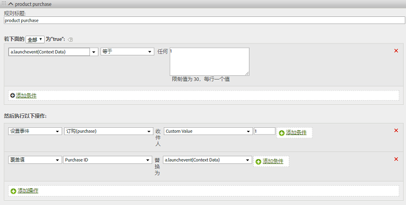

# 产品变量{#products-variable}

无法使用处理规则设置产品变量。 在移动SDK中，必须在上下文数据参数中使用特殊语法直接在服务器调用中设置产品。

To set the *`products`* variable, set a context data key to `"&&products"`, and set the value using the syntax defined for the *`products`*:

```js
cdata["&&products"] = "Category;Product;Quantity;Price[,Category;Product;Quantity;Price]";
```

例如：

```js
//create a context data dictionary 
var cdata = new Windows.Foundation.Collections.PropertySet(); 
 
// add products, a purchase id, a purchase context data key, and any other data you want to collect. 
// Note the special syntax for products 
cdata["&&products"] = ";Running Shoes;1;69.95,;Running Socks;10;29.99"; 
cdata["m.purchaseid"] = "1234567890"; 
cdata["m.purchase"] = "1"; 
 
var ADB = ADBMobile; 
// send the tracking call - use either a trackAction or TrackState call. 
// trackAction example: 
ADB.Analytics.trackAction("purchase", cdata); 
// trackState example: 
ADB.Analytics.trackState("Order Confirmation", cdata);
```

*`products`* 直接在图像请求中设置，而其他变量则设置为上下文数据：必须使用处理规则映射所有上下文数据变量：



您无需使用处理规则 *`products`* 映射变量，因为该变量是SDK直接在图像请求上设置的。
