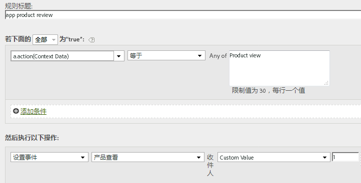

# 迁移到4.x SDK {#migrate-to-the-x-sdks}

本节介绍如何从以前的Windows Mobile SDK的3.x版本迁移到适用于Experience Cloud解决方案的Windows 8.1通用App Store 4.x SDK。

迁移到版本4.x后，所有功能现在均可通过静态方法访问，因此不再跟踪您自己的对象。

以下部分将指导您完成从版本3.x迁移到版本4.x的过程。

## 删除未使用的属性 {#section_145222EAA20F4CC2977DD883FDDBBFC5}

你可能注意到 `ADBMobileConfig.json` 文件。 此文件包含特定于应用程序的全局设置，并会替换在以前版本中使用的大多数配置变量。 以下是 `ADBMobileConfig.json` 文件的示例：

```js
{ 
    "version" : "1.0", 
    "analytics" : { 
        "rsids" : "coolApp", 
        "server" : "my.CoolApp.com", 
        "charset" : "UTF-8", 
        "ssl" : true, 
        "offlineEnabled" : true, 
        "lifecycleTimeout" : 300, 
        "privacyDefault" : "optedin", 
        "poi" : [ 
                    ["san francisco",37.757144,-122.44812,7000], 
                    ["santa cruz",36.972935,-122.01725,600] 
                ] 
    }, 
 "target" : { 
  "clientCode" : "myTargetClientCode", 
  "timeout" : 5 
 }, 
 "audienceManager" : { 
  "server" : "myServer.demdex.com" 
 } 
}
```

下表列出了需要移到配置文件的配置变量。将第一列中变量的值集移动到第二列中的变量，然后从代码中删除旧配置变量。

## 从3.x迁移

| 配置变量/方法 | 变量 `ADBMobileConfig.json` 文件。 |
|--- |--- |
| offlineTrackingEnabled | &quot;offlineEnabled&quot; |
| reportSuiteIDs | &quot;rsids&quot; |
| trackingServer | &quot;server&quot; |
| charSet | &quot;charset&quot; |
| currencyCode | &quot;currency&quot; |
| ssl | &quot;ssl&quot; |
| setOfflineHitLimit | 删除，不再使用。 |
| linkTrackVars | 删除，不再使用。 |
| linkTrackEvents | 删除，不再使用。 |

## 更新跟踪调用和跟踪变量 {#section_96E7D9B3CDAC444789503B7E7F139AB9}

而不是使用以Web为中心的 `Track` 和 `TrackLink` 调用，则版本4 SDK使用两种在移动设备领域更有意义的方法：

* `TrackState` 状态是指您的应用程序中提供的一些视图，例如“主页功能板”、“应用程序设置”、“购物车”等。 这些状态与网站中的页面类似，而且 `trackState` 调用会使页面查看次数递增。

* `TrackAction` 操作是指您的应用程序中发生的要测量的事件，例如“登录”、“横幅点按”、“信息源订阅”及其他量度。 这些调用不会递增页面查看次数。

的 `contextData` 用于这两种方法的参数包含作为上下文数据发送的名称值对。

## 事件、Prop、eVar

如果你看过 [SDK方法](/help/windows-appstore/c-configuration/methods.md)，您可能很想知道在何处设置事件、eVar、prop、继承人和列表。 在版本4中，您无法再在应用程序中直接分配这些类型的变量。 反而，SDK 使用上下文数据和处理规则将应用程序数据映射到 Analytics 变量以便进行报告。

处理规则为您提供了以下几个优势：

* 您无需向应用商店提交更新即可更改数据映射。
* 您可以对数据使用有意义的名称，而不是设置特定于报表包的变量。
* 对发送额外数据的影响很小。这些值在使用处理规则映射后才会显示在报表中。

有关更多信息，请参阅 *处理规则* in [Analytics](/help/windows-appstore/analytics/analytics.md).

您直接分配到变量的任何值都应添加到上下文数据中。 这表示调用 `SetProp`, `SetEvar`、以及对永久性上下文数据的分配都应全部删除，并将值添加到上下文数据。

**AppSection/服务器、GeoZip、交易ID、促销活动和其他标准变量**

您在测量对象（包括上面列出的变量）中设置的任何其他数据都应添加到上下文数据中。

简而言之，仅有通过 `TrackState` 或 `TrackAction` 调用是 `data` 参数。

### 替换跟踪调用

在整个代码中，将以下方法替换为对 `trackState` 或 `trackAction`:

### 从3.x迁移

* `TrackAppState` (TrackState)
* `TrackEvents` (TrackAction)
* `Track` (TrackAction)
* `TrackLinkURL` (TrackAction)

## 自定义访客 ID {#section_2CF930C13BA64F04959846E578B608F3}

将 `visitorID` 变量替换为对 `setUserIdentifier` 的调用。

## 离线跟踪 {#section_5D4CD8CD1BE041A79A8657E31C0D24C6}

离线跟踪在 `ADBMobileConfig.json` 文件。所有其他离线配置均会自动完成。

在整个代码中，删除对以下方法的调用：

### 从3.x迁移

* `SetOnline`
* `SetOffline`

## Products 变量 {#section_AFBA36F3718C44D29AF81B9E1056A1B4}

由于产品变量在处理规则中不可用，因此可以使用以下语法设置 `products`：

```js
// create a processing rule to set the corresponding product event. 
// for example, set the Product Views event when context data a.action = "product view" 
var cdata = new Windows.Foundation.Collections.PropertySet(); 
cdata["&&products"] = ";Cool Shoe"; 
ADB.Analytics.trackAction("product view", cdata);
```



在本例中， `"&&products"` is `";Cool Shoe`&quot;和应遵循您跟踪的事件类型的产品字符串语法。
